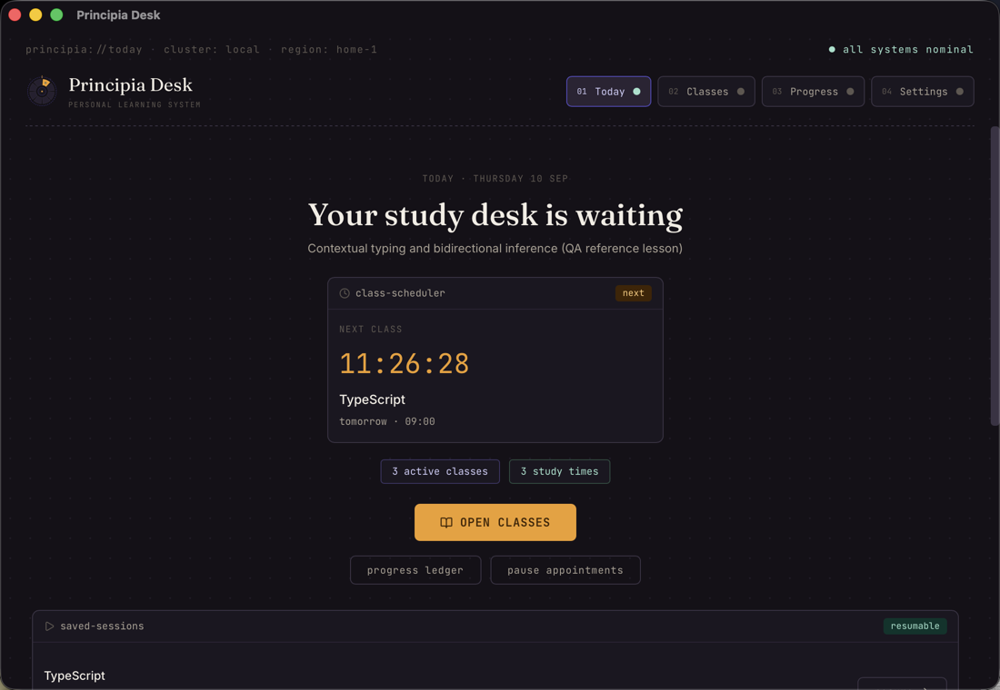
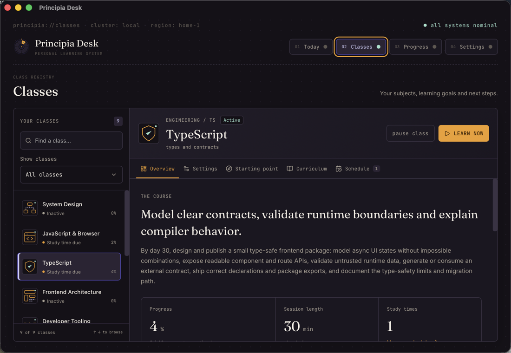
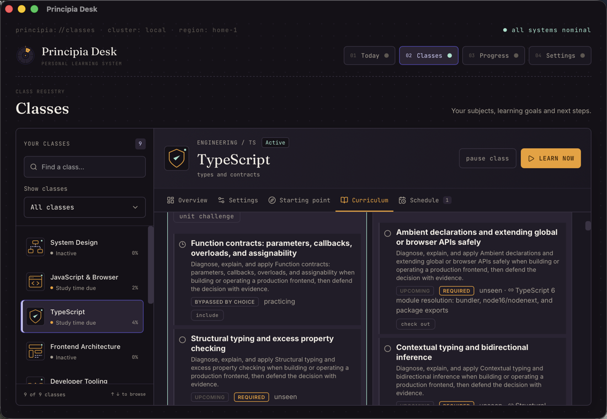
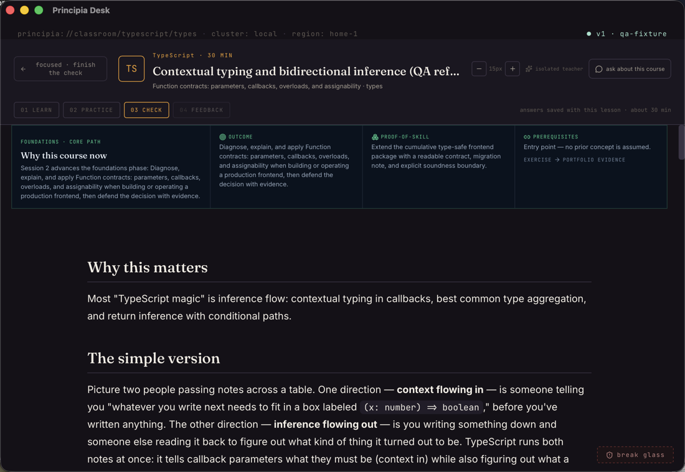
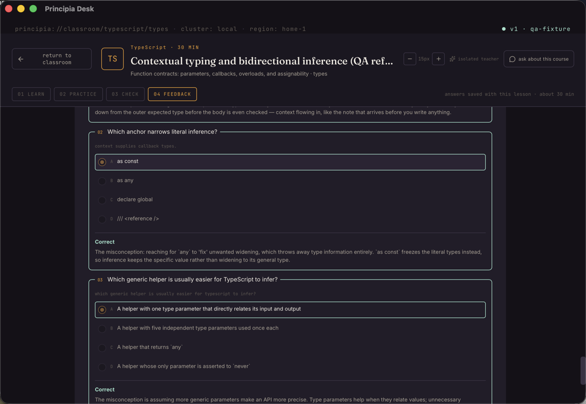
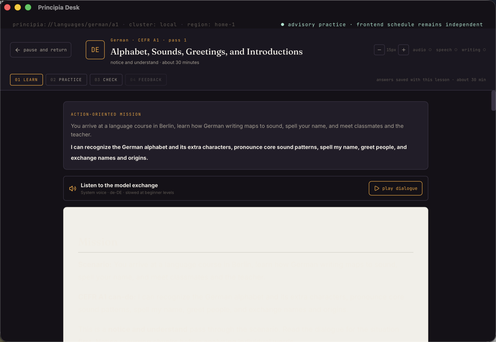
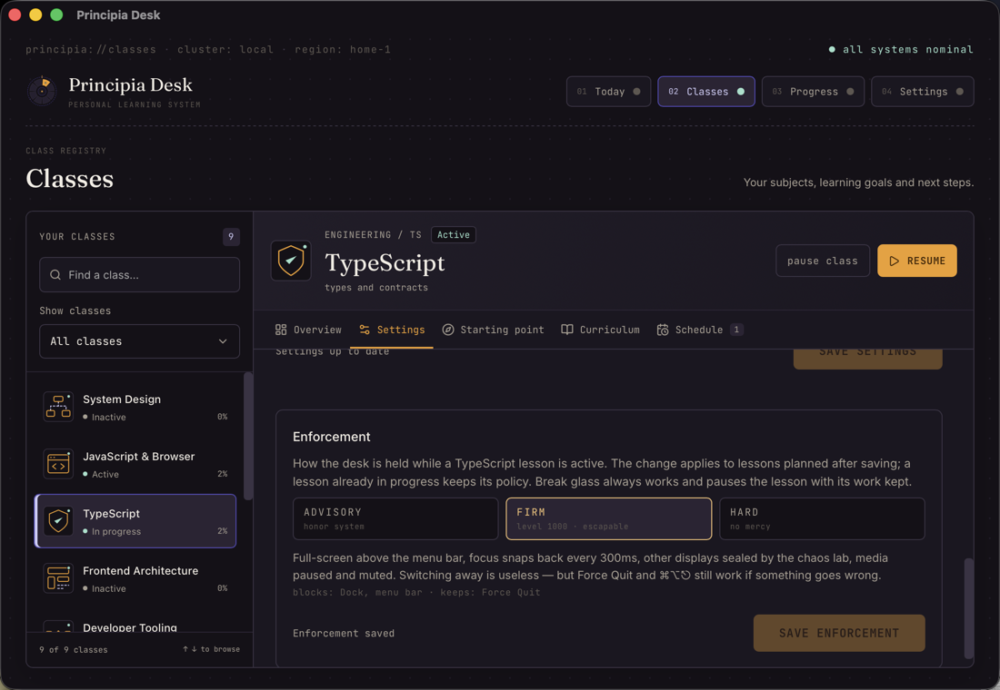

<p align="center">
  
</p>

# Principia Desk

**Understand deeply. Practice daily.** A macOS desk for learning subjects from their foundations: nine classes with personal starting points, lessons taught by your own AI tutor from verified primary sources, durable appointments, and enforcement you choose per class.

Principia Desk keeps the visual character of its predecessor and its database, and replaces the once-a-day routine with classes you schedule, a shared study runtime that saves every step, and honest progress denominators.



## What a day looks like

**Today** combines your classes' appointments. Each class has recurring study times; every enabled time produces one durable appointment per day that is due at its time, missed once the day passes, and consumed exactly once by the session that serves it. Missed appointments can be made up or skipped. Topics whose spaced review is due appear with a Start review action.

**Classes** hold the nine subjects: Linux Bash, Bash Scripting, JavaScript & Browser, TypeScript, Frontend Architecture, Developer Tooling, System Design, German and Italian. Each class has its own tutor, pace, study times, enforcement policy, accepted personal path and curriculum map.



## Starting points and personal paths

Every class starts where you already are. Choose the foundations, declare a starting stage with familiar topics, or take the placement check. The check samples every stage of the course, three skills each, and briefs you first: which stages it covers, what each one asks, how it places you and what skipping means. Lessons begin at the first stage you do not fully demonstrate, so no stage is skipped on a lucky answer and nothing is left unmeasured. The result is a path revision: an accepted entry point, the earlier material you can revisit, the refreshers upcoming work depends on, and the required outcome that remains. Declared familiarity and diagnostic samples never award completion, mastery or a streak.

Paths stay yours to revise. The Curriculum tab shows one status per topic against the accepted route (Completed here, Prior knowledge checked, Bypassed by choice, Needs refresher, Not assessed, Bridge lesson, In progress, Upcoming) with explicit denominators: required work on your route beside full-course core coverage. Check out of familiar topics, include them again, take a unit challenge to demonstrate a unit's entry samples, and accept or decline a bridge lesson when a failed check points at a prerequisite you set aside. Each decision is a new revision; history is never rewritten. When a course's curriculum changes, the class asks you to review its path before the next lesson.



## Lessons on one shared runtime

Engineering and language lessons run on one study runtime: planned on the accepted path, prepared under a lease by the class's tutor, published as an immutable lesson version with a frozen knowledge check, and finished in one transaction that records evidence, mastery and the appointment. Answers, production work, reading position and stage are saved as you go and restored after a restart. Failed preparation keeps the request for an explicit retry or discard.

The lesson shell is the same for every course: identity, stage rail (Learn · Practice · Check · Feedback), save state and time budget, reading size, and one return action. Engineering lessons add the purpose panel, reader, sources, exercise workspace, reflection and a tutor drawer; language lessons add the mission, model dialogue with system-voice playback, phrases, and writing and speaking practice before the check.





### Retrieval, bridges and unit challenges

- **Delayed retrieval**: when a topic's mastery review is due, a retrieval session (recall, check, feedback, no new lesson) is prepared without a provider from the topic's bundled reference questions, preferring ones the last lesson did not show; repeated samples are labelled as such.
- **Bridge lessons**: a failed check on a topic whose prerequisite was set aside proposes a short bridge lesson; accepting it serves that topic next, once.
- **Unit challenges**: class-owned assessment attempts that sample a unit's entry questions; passing samples let you check out of exactly those topics, with no lesson, appointment or lock involved.

### German and Italian

Each language ships 40 scenario units across A1–B2 with seven passes per scenario, and each pass has its own task family: recognition, form and meaning, guided interaction, listening transfer, written production, spoken production and integrated retrieval. Curated checks rotate so consecutive passes share at most one item, and a pass counts only with the practice evidence its phase needs (the exchange played, twelve written words, the speaking task marked done). Practice evidence stays self-reported and is never presented as assessed proficiency; CEFR dates are planning targets, not certificates.



## Enforcement you choose per class

Each class carries a focus policy: **advisory** (the window comes to front, nothing is blocked), **focused** (full-screen above the menu bar, focus snaps back, other displays sealed, media paused; Force Quit still works) or **strict** (also blocks Cmd+Tab, Force Quit, logout and shutdown while locked). A native focus coordinator admits one focused or strict session at a time, engages the kiosk when it activates, releases it on completion, skip or the escape hatch, and re-engages after a restart. Starting another class while a focused session holds the desk is refused; the focused session cannot be paused from the lesson.



### Ways out of a locked session

Strict mode blocks Cmd+Tab, Force Quit and logout, so it must never be the only thing standing between you and your own machine. Five ways out, in the order you would reach for them:

1. **Finish the check.**
2. **Break glass.** A dim link reveals a long phrase rendered as non-copyable SVG (paste disabled). Typing it pauses the focused class lesson with its work kept and releases the lock; three wrong attempts lock the input for 60 seconds.
3. **The recovery console.** Press **Control + Option + Shift + U** (Ctrl + Alt + Shift + U on Linux and Windows). A small console opens above every window, a locked desk included; the combination is registered with the system, not the page, so a blank or frozen desk cannot swallow it. Four commands, typed in order, end the session:

   | # | Type | What happens |
   |---|------|--------------|
   | 1 | `unlock` | Reports the desk's state, says what releasing will do and issues a six-character challenge code (valid for five minutes). |
   | 2 | `confirm <code>` | Type the code back. It proves a person is at the keyboard; a wrong code keeps the challenge, an expired one starts over. |
   | 3 | `phrase <your escape phrase>` | The break-glass phrase from setup, exactly as written. Three wrong attempts lock this step for 60 seconds. |
   | 4 | `release` | Pauses the session with its work intact, breaks the streak, drops the lock and closes the console. |

   `status` shows where you are in the sequence, `cancel` starts it over, `close` (or Esc) leaves the console with the desk untouched. Nothing changes until the fourth command. If the console itself cannot appear, **press the combination five times within ten seconds** and the lock releases on its own. The same steps are shown in Settings › Recovery, with a walkthrough you can replay.

   The combination is one registration, named per platform by the desk itself: macOS calls it Control + Option + Shift + U (a system hot key, no permission needed, works over full-screen apps and on every Space); Windows and Linux call it Ctrl + Alt + Shift + U. On Windows another program already holding the combination makes registration fail; on Linux it needs X11, since Wayland desktops do not hand global shortcuts to applications. Settings › Recovery shows whether the system took it; when it did not, the release token and the escape hatch still stand.
4. **A release token.** Create a file or folder named `principia-unlock` in any of these places and the lock releases within a second:
   - your home directory (`touch ~/principia-unlock`),
   - the temporary directory (`/tmp` on macOS and Linux),
   - **the root of any mounted volume** — a USB stick, an external disk, a mounted share.

   The volume rule is the one that needs no terminal and no second machine: prepare a stick once, keep it near the desk, and plug it in. While a token exists the kiosk also refuses to engage at all, so a machine that boots with the stick in stays free. Delete the token to re-arm.
5. **The dead man's switch.** A lock releases itself after three hours regardless of what the app believes. No lesson runs that long; a lock still standing is a stuck process, and it lets go.

A force shutdown alone does not end a session: an active focused session reopens at its saved position on the next launch. Boot with the release token in place instead.

### Recovery (if a broken build ever locks you out)

The kiosk refuses to engage until the webview reports ready (white-screen guard), so a dead frontend cannot hold a lock. If you are ever stuck anyway:

1. **Open the recovery console** with Control + Option + Shift + U and walk the four steps above; or press the combination five times in ten seconds if no console appears.
2. **Plug in the release stick** described above, or create the file from another machine over SSH or Screen Sharing:
   ```bash
   touch ~/principia-unlock
   launchctl bootout gui/$(id -u) ~/Library/LaunchAgents/com.darkmatter.principia-desk.plist
   rm -f ~/Library/LaunchAgents/com.darkmatter.principia-desk.plist
   ```
3. **Safe Mode** (Apple Silicon: hold power → pick disk → hold Shift): third-party LaunchAgents do not load. Run the same commands in Terminal, reboot.
4. **Recovery Mode Terminal**: `rm "/Volumes/Macintosh HD/Users/<you>/Library/LaunchAgents/com.darkmatter.principia-desk.plist"` and `touch "/Volumes/Macintosh HD/Users/<you>/principia-unlock"`, then reboot.

Nothing here depends on the main window being healthy: the console is its own window on a system-wide shortcut, the token is checked by the same loop that holds focus, and the dead man's switch fires without any input at all.

## Content generation: your provider

Settings separates **Runners & models** from the **Active tutor**. Three runner routes are supported:

- **An agent I already have:** Claude Code, Codex, Cursor Agent, Gemini CLI or a custom command. Each CLI keeps its existing authentication.
- **My own API key:** Anthropic, OpenAI, Google Gemini, OpenRouter, Groq, Mistral or DeepSeek. Keys are shared by the desk and its classes; on macOS, save them in Keychain from Settings. Environment keys take priority.
- **On this machine:** Ollama installation, detection and start, installed models, a model shelf with approximate download and RAM sizes, background downloads, testing and removal. Local models answer locally; the teaching backend still fetches source documentation from the web.

Each class keeps its own tutor choice and prompt contract. Lesson generation uses exactly the configured provider and model and must pass the full course, five-check, exercise, source and first-principles quality gate; a missed gate gets one same-provider correction pass and a same-provider senior-editor review, otherwise the real error is shown. Bundled reference lessons exist for every engineering course in five roles (beginner, advanced, remediation, retrieval, capstone); they feed retrieval sessions and offline checks and are never substituted for a generated lesson. See [the runner implementation record](docs/AGENT_BACKEND_PORT.md).

## Sourcing: what lessons are taught from

Lessons are taught from documentation the app fetches itself. Before each generation, Rust retrieves up to five primary documents from an allowlist of publishers (MDN, web.dev, the WHATWG and W3C specifications, TC39, Chrome/V8/WebKit developer docs, Node, TypeScript, the major framework docs, RFCs, and GNU/Linux manuals for the Bash courses), extracts the readable prose, and hands it to the tutor as quoted material it must cite inline. A lesson must link at least three retrieved documents on the claims they support; every URL in the reading list is verified over the network and unreachable ones are removed. If retrieval fails entirely, the lesson still runs without unverified links and the generation log says why.

Every concept carries a specific curriculum brief: learner outcome, named mechanisms, production scenario, misconceptions, observable evidence, cumulative artifact and in-policy primary sources, validated offline.

## Always on: the menu bar desk and the study alarm

The desk stays resident. Closing the window or pressing Cmd+Q hides it behind a menu bar icon; the launch agent starts it at login and at every study time, and Quit lives in the icon's menu. That menu says what is due, what comes next and when, and lists today's appointments with their state.

When an appointment comes due the desk sends a system notification and starts an alarm that repeats until the lesson starts. The menu bar shows the class as due, Today shows the same banner, and both offer exactly two things: **Start**, and a **snooze** of 5, 10 or 15 minutes that rings again when it passes. There is no dismiss. The break-glass phrase lives inside the started lesson, so the way out of a session still exists, but only after it has begun. Quit is withheld while an alarm rings or a focused session holds the desk.

Two things outrank the alarm, because nothing here may hold a machine hostage: pausing appointments, which owes nothing and so rings for nothing, and the release token described above, which silences it along with every lock. `--debug-day` builds never ring unless `PRINCIPIA_ALARM_IN_DEBUG` is set, so QA profiles stay quiet.

## Scheduling

A launchd LaunchAgent (`~/Library/LaunchAgents/com.darkmatter.principia-desk.plist`) fires the app at every enabled study time with one `StartCalendarInterval` array:

- A time missed while **asleep** fires on wake; missed while **powered off** fires at next login, and the app materializes the day's appointments on every launch and every 60 s.
- Already running: an in-app watcher marks appointments due at the scheduled minute; focused and strict classes engage the kiosk when their session activates.
- Changing any study time rewrites and reloads the interval set; overlapping times across active classes are refused with the conflict named.

## Install

### Prerequisites

- macOS 13+
- A supported CLI, a provider API key, or Ollama with a downloaded chat model.
- To build: Rust 1.80+, Node 20+.

For an installed app, choose **My own API key** in Settings and save a key for the provider you want. Keys use the `principia-desk` Keychain service with separate `<provider>_api_key` accounts; a key saved under the previous service name is still read, so an upgrade never looks like a lost key. On other platforms, supply `ANTHROPIC_API_KEY`, `OPENAI_API_KEY`, `GOOGLE_API_KEY` (or `GEMINI_API_KEY`), `OPENROUTER_API_KEY`, `GROQ_API_KEY`, `MISTRAL_API_KEY` or `DEEPSEEK_API_KEY` to the process.

### Build from source

```bash
git clone https://github.com/dark-matter08/system-design-roulette.git
cd system-design-roulette
npm install
npm run tauri build -- --bundles app
cp -R "src-tauri/target/release/bundle/macos/Principia Desk.app" /Applications/
```

Launch it, complete the setup (escape phrase and tutor check), add a class with a starting point and a study time, and it is armed.

> **Heads-up:** the app is ad-hoc signed. First launch may require right-click → Open, or `xattr -dr com.apple.quarantine "/Applications/Principia Desk.app"`.

### Upgrading from System Design Roulette

The product carried its old identifiers for a while so a rename could not strand anyone's history. They have now moved with the name, and the first launch under the new identity brings the old profile across rather than starting you empty:

- The bundle identifier is `com.darkmatter.principia-desk` and the database is `principia.db`. If this build finds no profile of its own, it takes a consolidated copy of the one written under the old identifier, including anything still in its write-ahead log, and leaves the original untouched.
- The Keychain service is `principia-desk`. Reads fall back to the old service, so saved provider keys keep working.
- The launch agent is `com.darkmatter.principia-desk`. The agent installed under the old identity is unloaded and deleted on first launch, so a machine never carries two.
- The release token is `principia-unlock`, and a stick prepared with the old `sdr-unlock` name still frees a locked desk.

Numbered migrations still run after a pre-upgrade backup, and finished daily-routine sessions still import into the shared runtime once. See [docs/STORAGE.md](docs/STORAGE.md).

## Architecture

```
┌──────────────────── Svelte 5 webview (renderer) ──────────────────────────┐
│  Today · Classes (overview, settings, starting point, curriculum, schedule)│
│  LessonShell (engineering and language activities) · Progress · Settings  │
└────────────────────────────────────┬──────────────────────────────────────┘
                          invoke / events (typed IPC)
┌────────────────────────────────────┴──────────────────────────────────────┐
│  Rust core (all authority lives here)                                      │
│  domain/sessions.rs     shared study runtime: lifecycle, leases, versions, │
│                         checkpoints, results                               │
│  domain/assessments.rs  frozen rounds, revisioned answers, submissions     │
│  domain/classes.rs      accepted paths, revisions, bridges, selection      │
│  domain/placement.rs    entry banks, diagnostics, recommendations          │
│  domain/challenges.rs   unit challenges                                    │
│  domain/schedule.rs     durable appointments                               │
│  subjects/              engineering and language adapters                  │
│  enforcement.rs         focus coordinator; kiosk.rs the macOS lock         │
│  storage/               numbered migrations, backups, legacy import        │
│  generator.rs           strict lesson generation and bundled references    │
└────────────────────────────────────────────────────────────────────────────┘
```

Design principle: **Rust owns all authority.** Lifecycles, locks, grading and selection live in the backend; the webview renders and requests transitions, which Rust validates. Data lives in `~/Library/Application Support/com.darkmatter.system-design-roulette/` as a SQLite database with WAL journaling and pre-upgrade backups. Contracts are described in [docs/SHARED_SESSION_RUNTIME.md](docs/SHARED_SESSION_RUNTIME.md) and [docs/STORAGE.md](docs/STORAGE.md); the design system in [DESIGN.md](DESIGN.md).

## Development

```bash
npm run tauri dev          # full app against a dev server
npm run dev                # frontend only, in a browser, with mock data
npm run check              # catalogue check + svelte-check
npm test                   # frontend tests
cd src-tauri && cargo test # Rust integration tests
```

Useful flags and env vars:

| Flag / env | Effect |
|---|---|
| `--debug-day` | No OS lock (the focus coordinator only records the lock), schedule ignored |
| `--triggered` | What launchd passes; goes straight to the appointment check |
| `PRINCIPIA_DATE=2026-06-12` | Override "today" for multi-day flows |
| `PRINCIPIA_CLAUDE_BIN=/path` | Override the Claude binary (`/usr/bin/false` makes preparation fail deliberately) |
| `PRINCIPIA_CODEX_BIN=none` | Disable the Codex runner |
| `DEEPSEEK_API_KEY=...` | Authenticate DeepSeek for the whole process |
| `OLLAMA_URL=http://127.0.0.1:11434` | Optional loopback Ollama endpoint; remote endpoints are rejected for the local route |
| `touch ~/principia-unlock` | Instantly release the kiosk lock |

The `study_fixture` example publishes a bundled reference lesson into a class's planned session without a provider (`cargo run --example study_fixture -- <db> <subject> [--fail|--skip]`), which is how the desktop checks in `docs/DESKTOP_ASSESSMENT_QA.md` were run against an isolated profile. Demo mode in a plain browser serves canned data from `src/lib/mock.ts` with the same contracts as the native commands.

## The Teacher

The generation layer is a persistent teaching agent; see [docs/TEACHER.md](docs/TEACHER.md). A per-concept mastery ledger is compiled into a dossier so each lesson builds on prior work and attacks recorded misconceptions. The engineering catalogue spans 300 concepts across seven courses with a visible foundations → mechanisms → production → synthesis path before electives; each course has a curriculum map, entry map, diagnostic bank and reference lessons. Progress separates curriculum coverage, demonstrated competency, practice evidence and review due, each with its own denominator.

## Roadmap

- [ ] Windows and Linux wake-up and enforcement verification
- [ ] Rescheduling a single appointment
- [ ] Notarized builds and installers

## License

[MIT](LICENSE)
