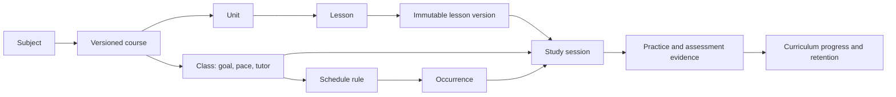

# Principia Desk — product evolution plan

Plan prepared on 2026-09-09 for PR #1. The user has finalized **Principia Desk** as the product name, requested **Linux Bash** and **Bash Scripting** as initial courses, and requested support for learners who already have subject knowledge. Implementation is now authorized and underway; section 13 records verified progress and outstanding work. Base reviewed: `73dfa512b9da82d76e453e6dcb0d72aa1db21554`; PR head: `a4840f51b4f55cd584d78c957a186e8406336f11`. Continue on the existing `feat/frontend` branch and PR.

**The product direction is a personal teaching app with structured classes, practical work and durable learning.** Keep the native Tauri/Svelte/Rust/SQLite foundation, the single-learner model and local learning records. Broaden the subject model while preserving System Design as a first-class offering. The first release should make the existing subjects and the two new shell courses coherent; a course marketplace, school administration, accounts, billing, cloud synchronization and an arbitrary subject/plugin platform are outside this plan.

Implementation follows the planned direction: System Design returns alongside the six exposed subjects and the two new shell courses, and focused/enforced study becomes an optional class policy. Existing enforcement preferences must survive migration. The product name, Principia Desk, and inclusion of Linux Bash and Bash Scripting in the initial catalog are decided.

**What the PR is actually based on.** The original product combined a daily commitment mechanism with a teacher: scheduled sessions, retrieval of previous material, concept selection, generated lessons, practice, feedback and mastery. The first large PR commit expands that teacher into frontend engineering tracks and CEFR language programs. Later commits consolidate exercises/chat, retire duplicated language management, add completion rules and strengthen first-principles prompts. This supports a broader teaching product, but its structure still gives one daily frontend session special treatment and runs the other classes through two additional engines.

The source supports that interpretation directly:

| Evidence in the PR | Product implication |
|---|---|
| `focus.rs` excludes `system-design`; `classroom.rs::SUBJECTS` omits it | The PR changes the subject focus as well as broadening the app. Restoring the original subject needs an explicit work item. |
| Primary `session.rs`, engineering `classroom.rs` and CEFR `language.rs` maintain separate lifecycles | Shared widgets and storage APIs do not yet produce one consistent class model. |
| Three readers and a 943-line `ClassroomPanel` | Navigation, preparation, settings and learning are mixed together. |
| `DESIGN.md` frames every action as a system topology | Vocabulary appropriate for System Design is now being applied to language learners. |
| First-principles prompts, learner dossiers, exercises, retrieval and source grounding | These are the teaching capabilities worth retaining under the new identity. |

**Product identity: Principia Desk.** The name is finalized. Position the app as an intentional place to understand subjects from their foundations. Use this exact display name throughout the planned UI, onboarding, documentation and installer labels. The suggested tagline is **Understand deeply. Practice daily.**; tagline and visual identity remain proposals. Apply the compatibility rules in the rebranding workstream when implementing the rename.

**Visual direction clarified during implementation:** the user rejected the simplified preview and requested the design on `main` as the reference, specifically for visual design. Preserve its blueprint grid, node headers, numbered rails, dashed connectors, status LEDs, compact monospace controls, amber actions, colored metadata badges, serif headlines and paper reader. The catalog, entry-level support and structural work remain in scope. The later class-workspace request adds a searchable class sidebar and a large detail pane with independently scrollable tabs. Keep four global destinations: Today, Classes, Progress and Settings. Scheduling belongs to each class; Today provides the combined agenda. [DESIGN.md](../DESIGN.md) now records this explicit constraint.

**1. Establish the product vocabulary and catalog.** Use the same meanings in code, database contracts, UI copy, fixtures and documentation. The main navigation should say **Classes**; the internal subject catalog describes what can be studied.

| Term | Meaning | Example |
|---|---|---|
| Subject | Stable discipline identity | System Design, German |
| Course / learning path | Versioned curriculum with a defined outcome | System Design Foundations; German A1–B2 |
| Class | The learner's enrollment in a course, with a goal, pace, schedule and tutor settings | My German class, starting at A1 and targeting A2 |
| Unit | A coherent group of objectives and lessons | Storage and retrieval; introducing yourself |
| Lesson | A planned learning unit with content, activities and checks | Cache invalidation; a first introduction dialogue |
| Lesson version | Immutable content and assessment material prepared for use | A stored lesson generated with a particular prompt/profile |
| Study session | A specific attempt at a lesson or retrieval checkpoint | Today's attempt, still resumable tomorrow |
| Competency | What the learner can demonstrate; may span several lessons | Explain invalidation tradeoffs; introduce yourself appropriately |
| Entry profile | Per-class prior knowledge, with evidence and uncertainty for individual competencies | Comfortable with Bash pipelines; quoting needs a refresher |
| Placement check | Optional diagnostic used to recommend a starting point and targeted refreshers | A short command-reading task and a scripting exercise |
| Personal learning path | Versioned selection of course work based on the goal, entry profile and prerequisites | Begin at functions, with a short quoting refresher |
| Review | Retrieval of previously studied competencies | Delayed questions due this week |
| Schedule occurrence | A particular appointment produced by a recurring rule | German, Monday at 18:00 |

Avoid using `course` for one generated document, `class` for both a subject and an attempt, or `completed` for every kind of progress. Existing types can retain legacy names inside compatibility adapters during migration; the new public contract uses the definitions above.

Start with one supported course per subject and one active class per course. Preserve existing dormant/enabled settings. Classes has Active, Paused and Completed filters. Add class offers Continue or Reactivate when an enrollment already exists, rather than creating duplicates. Its short flow is course → goal and starting point → optional placement check → personal path preview → pace, tutor defaults and saved study times → class activation. Multiple courses and enrollments can fit the IDs later without requiring a course builder now.

The initial catalog should contain nine courses, initially one per subject entry. Linux Bash and Bash Scripting are separate offerings: interactive command-line fluency and script-based automation respectively.

| Subject | Current inventory | Required treatment |
|---|---:|---|
| System Design | 72 legacy concepts, currently unselectable | Restore with valid curriculum briefs, preserving IDs, slugs and history. |
| JavaScript & Browser | 57 concepts: 35 core, 22 elective | Organize core scope, electives and specific practical outcomes. |
| TypeScript | 46 concepts: 35 core, 11 elective | Same contract, with type/runtime boundary practice. |
| Frontend Architecture | 43 concepts: 35 core, 8 elective | Same contract, with design decisions and system artifacts. |
| Developer Tooling | 46 concepts: 35 core, 11 elective | Same contract, with runnable tools and diagnostics. |
| Linux Bash | New curriculum to author | Linux terminal foundations, files, pipelines, text processing, permissions and processes; stable ID `linux-bash`. |
| Bash Scripting | New curriculum to author | Reliable shell automation, arguments, control flow, functions, error handling and testing; stable ID `bash-scripting`. |
| German | 40 scenario units across A1–B2 | Preserve CEFR-specific progression and practice. |
| Italian | 40 scenario units across A1–B2 | Same language capabilities, distinct content and speech locale. |

Create one catalog manifest for stable IDs, labels, subject kind, course versions, prompt profiles and supported capabilities. Rust loads and exposes it; the UI and mock fixtures consume that contract. Eliminate separate hand-maintained inventories in `focus.rs`, `classroom.rs`, IPC unions, onboarding and mock data. Validate references and prerequisite graphs before shipping.

Both new courses use the engineering subject adapter and the same class, lesson, schedule and progress contracts. Bash Scripting recommends Linux Bash or equivalent command-line fluency; use the shared entry-profile and placement flow below so experienced learners can start directly. Record that prerequisite in the catalog and show it in Add class and the course overview. Do not invent existing lesson counts or enrollments for these new offerings.

Simply adding System Design to the selectable list is unsafe: its 72 retained concepts lack the curriculum briefs required by the new validator. Author and validate its baseline course before making it selectable. Also update research routing: the current source allowlist is oriented toward frontend documentation and discovery uses MDN. Add subject-appropriate source policies for distributed-systems documentation and papers, with a System Design generation fixture that demonstrates relevant grounding. Historical System Design content remains readable throughout this work.



**1a. Start from what the learner already knows.** Every initial course must support an experienced entry point. Starting knowledge belongs to a class and its competencies: the same learner can be advanced in JavaScript, new to System Design, and uneven across Bash topics. A single account-wide Beginner/Intermediate/Advanced label is insufficient. Separate the starting point from the target goal and from the learning pace.

The reviewed PR only partially supports this: `language.rs::configure_program` accepts a declared starting band and uses it as the current band before any language session exists; engineering configuration in `classroom.rs` rejects level settings, and `roulette.rs` favors the earliest eligible phase/tier. There is no shared diagnostic evidence model. Changing a language start after sessions exist also preserves the current band while changing the denominator's starting band. This work therefore includes native selection and progress rules, not just an onboarding selector.

Offer three routes during Add class:

| Choice | Learner experience | How it affects the path |
|---|---|---|
| Start from the foundations | Start immediately; no assessment required. | Follow the introductory path, with unit checks available later to skip familiar material. |
| Help me find my level | Take an optional short diagnostic, with Skip / I don't know and a visible effort estimate. Target roughly 5–10 minutes for the initial check; offer a longer practical task only when useful. | Recommend an entry unit, relevant refreshers and any uncertain prerequisites. A brief sample does not establish mastery of the whole course. |
| Choose my starting point | Select a course-specific level or unit and indicate familiar topics. No mandatory entrance exam. | Begin there with an explicitly provisional entry profile and visible prerequisite advice; unverified topics can be checked during relevant practice. |

Persist an enrollment draft and any diagnostic answers so closing onboarding does not lose work. Accepting a path saves the class setup. Activation additionally requires at least one enabled, saved study time; an unscheduled class stays inactive. Skipping or failing to load a diagnostic always leaves the foundations and manual-entry routes available. Placement carries no focus lock or time penalty.

The path preview explains **where you will start, which material you can bypass, why that is recommended, and which gaps need a short refresher**. Offer Accept path, Change starting point and Include foundations. Keep bypassed material visible and available for voluntary study. Class overview and curriculum use the same controls; learners can check out of a familiar unit or adjust their path later without resetting their class or history.

Diagnose named competencies using course-authored questions and practical rubrics. Use prerequisite order and explicit per-competency coverage/pass criteria, rather than one aggregate score or an opaque model guess. Preserve criterion-level results, including partial success, skipped responses and unevaluated work; missing evidence remains unknown. Select bounded follow-up tasks for uncertain prerequisite clusters. Freeze questions, rubric and curriculum version for each attempt using the shared assessment runtime. A starter diagnostic should work from bundled content; provider-assisted evaluation may enrich recommendations, but unavailable or uncertain grading cannot silently award credit.

Represent uneven knowledge directly. For example, a Bash learner who knows pipelines, variables and control flow but mishandles quoting can start script functions with a quoting refresher before argument-handling practice. A JavaScript developer entering TypeScript can bypass demonstrated runtime fundamentals and focus on narrowing and type modeling. Reuse evidence across courses only for explicitly mapped equivalent competencies and compatible versions; experience in one subject must not waive unrelated prerequisites.

Self-selected familiarity, assessed prior knowledge, lessons completed here and imported historical progress retain distinct provenance. Manual skips change the learning route; they do not create grades or completion evidence. Diagnostic evidence may satisfy specifically covered prerequisites and course-defined entry requirements, but does not create completed lesson records, a study streak, or durable mastery by itself. Course-required final assessments/capstones remain required unless an explicit, equivalent assessed-credit rule applies. If the learner already demonstrates all entry competencies for their goal, offer the remaining goal assessment, maintenance/review, or a higher goal instead of inventing beginner work.

Use early practice and later retrieval to refine the entry profile. When a gap appears, explain and propose a small bridge lesson before dependent work; do not automatically restart the course or silently change the accepted starting point. Reassessment creates a new attempt and path revision. Existing sessions retain their lesson and assessment versions, submitted results and saved work; a changed path takes effect for subsequent selections. Prior evidence remains in history even when fresh practice is needed.

For German and Italian, keep a declared CEFR starting band and target alongside separate evidence for reading, writing, listening and speaking. Selecting B1 is a starting preference, not an assessed B1 certification. Missing audio or speaking evaluation leaves those skills unassessed and does not force a reading-capable learner back to A1. Engineering courses use their own units and competency groups; do not invent one universal scale across all subjects.

**2. Define one learner experience.** Use four destinations: **Today, Classes, Progress, Settings**. Remove the duplicate top-level Schedule screen and once-a-day routine. Classes own recurring study times; Today combines their agenda. Subject browsing lives under Add class rather than competing with My classes in navigation.

| Destination | Contents and actions | Current code to split or replace |
|---|---|---|
| Today | Pin the foreground or most recently used session; list other paused sessions, due appointments, the next class and reviews due | `Idle.svelte`, `next-class.ts`, state routing |
| Classes | Searchable sidebar with status filters; selected class in a large detail pane | `ClassWorkspace.svelte` replaces `ClassroomPanel.svelte` |
| Class details | Overview, Settings, Starting point, Curriculum and Schedule tabs; retain drafts while switching classes and tabs; scroll within the pane | `ClassDetail.svelte` and focused class components |
| Class Schedule tab | Study times and weekly planner; preview before saving; surface conflicts before applying | `ClassSchedule.svelte`; shared occurrence validation remains pending |
| Progress | Filtered history across every class; earned milestones, assessed skills, review needs and saved work | `Dashboard.svelte` plus new unified history reads |
| Settings | Provider credentials/defaults, study preferences, focus behavior, audio and recovery | Settings embedded in Idle and setup |

Today should privilege the next useful action over settings and statistics. Multiple classes may have resumable work; list the other paused sessions beneath the pinned one. During enforcement, explain why their Resume actions are temporarily unavailable. A suggested desktop structure is:

```text
+----------------+-------------------------------------------------------+
| Principia Desk | Today                               Study preferences |
|                |                                                       |
| Today          | Continue your System Design lesson                    |
| Classes        | Cache invalidation · Practice · Draft saved            |
|                | [Resume lesson]                                       |
| Progress       |                                                       |
| Settings       | Today's schedule                                      |
|                | 18:00 German · Introducing yourself       [Start]     |
|                | 20:00 TypeScript · Narrowing               [Details]   |
|                |                                                       |
|                | Reviews due                         [Start review]    |
|                | Your classes                       [View all classes] |
+----------------+-------------------------------------------------------+
```

The wireframe illustrates information order, not a final visual design. The user's later design clarification supersedes its sidebar arrangement: implement these destinations with compact navigation and the existing visual system from `main`. At narrow widths use a compact navigation control and one content column. Design for the existing 1100×760 default window first.

Use a shared **LessonShell** with a stable header, objective, stage navigation, reading preferences, time/commitment status, save state and a clear return/recovery action. The shell renders a typed set of supported activities:

- Engineering: explanation, diagrams and examples; code or design artifacts, including shell commands, terminal transcripts and scripts; hints; evidence/reflection; knowledge checks.
- Languages: explanation and dialogue; phrases and playback; listening, writing and speaking practice; knowledge checks.
- Shared where supported: Markdown reader, contents, sources, tutor drawer, narration controls, feedback and session results.

The common learning purposes are **Recall → Learn → Practice → Check → Feedback**. Reserve Review for delayed retrieval. Each course defines its required stages and time budget. A retrieval-only session omits the new lesson; language listening is an activity within its specialized workspace. Do not force every subject to have identical length, questions or widgets. Hide unavailable capabilities. For example, a language tutor drawer requires a language-grounded backend context before it can be advertised; current chat support is engineering-specific.

Keep optional roulette as a way to choose among eligible next lessons in the accepted personal path, with a deterministic persisted choice. Put it behind Choose for me. The default class action is Continue learning, whose selected topic and reason are visible. Both actions respect the entry profile, current path revision and prerequisite advice; neither reschedules bypassed introductions by accident. A random reveal must not change prerequisites or assessment evidence.

**3. Make states and visual rules consistent.** Preserve the visual character of `main` throughout the app, as explicitly requested during implementation. Keep the quiet paper reader, blueprint application background, compact node panels, status badges, numbered rails and monospace controls. Use consistent learning terms for destinations and operations; the following mappings explain their meaning without requiring the removal of the original visual vocabulary.

| Existing term | Product term |
|---|---|
| Cluster overview | Progress |
| Deploy / ACK | Start lesson / Submit answer |
| TTL | Time remaining |
| Error budget | Quiz result |
| Uptime | Study streak |
| DLQ | Review needed |
| Leader election | Choose next lesson |
| Egress queue | Resources |

Define semantic tokens for background, surface, text, muted text, border, accent, success, warning and error in both themes. Resolve the currently undefined variables such as `--text`, `--green`, `--amber` and `--good-fg`; migrate hardcoded palettes in `CoursePurpose` and `CurriculumMap`. Use subject accents as identity cues within the existing design system. Preserve `main`'s compact monospace navigation, node headers, controls and metadata, paired with readable body text and comfortable article width. Do not replace that hierarchy with uniformly large controls or generic panels.

Extend the existing `NodeCard`, `MetaBadge`, `StatusLED`, `TimePicker` and button styles first; extract their repeated patterns, such as the setup rail, into reusable components. Add Field, Select, Tabs, Drawer, Dialog and EmptyState primitives where they remove real duplication. Use proper labels, keyboard navigation, focus restoration, visible focus, sufficient contrast and reduced-motion support. Bundle required fonts/assets or provide reliable local fallbacks for a desktop app.

Required states apply to all classes:

| State | Behavior |
|---|---|
| App data unavailable | Show a recoverable boot error with Retry and recovery access; do not strand the learner behind a loading screen or acquire enforcement on incomplete initialization. |
| No classes | Explain Add class and guide goal/pace selection. |
| Starting point / placement | Offer all three entry routes; preserve draft answers; distinguish an assessment in progress, unavailable evaluation and a recommendation ready for acceptance. |
| Preparing | Keep class context; show preparation status; prevent duplicate starts; expose retryable errors. Leaving the view does not imply cancelling a native job. |
| Scheduled and due | Start the specific occurrence; show completion or skip exactly once. |
| Paused/restarted | Restore the same session, lesson version, answers, drafts, stage and reading position. |
| Save pending/failed | Show status, retain the content and retry; flush outstanding saves before navigation. |
| Needs more practice | Show assessed mistakes, corrections and the next practice/review action. |
| Submission failed | Preserve the frozen round and answers; allow an idempotent retry without duplicating grades or progress updates. |
| Completed session | Show evidence saved, corrections, progress change and the next useful action. |
| Goal complete | Offer review, explicit revisit or goal extension; retain earned completion. |
| Focused session | Explain restrictions; expose recovery independently of the active lesson tab. |

**4. Establish a shared backend domain incrementally.** Keep Rust authoritative. Thin IPC handlers should validate requests and call domain operations. They must not contain a second copy of lifecycle or grading rules.

An intended destination for the modules is:

```text
src-tauri/src/
  domain/
    catalog.rs          # subject/course/unit/lesson definitions
    classes.rs          # enrollment, goals and tutor configuration
    placement.rs        # entry profiles, diagnostic decisions and path revisions
    sessions.rs         # lifecycle, ownership and persisted stages
    assessments.rs      # frozen rounds, submissions and feedback
    progress.rs         # evidence and progress projections
    schedule.rs         # rules, occurrences and due-work decisions
  subjects/
    engineering.rs      # concept graph, experiments, engineering rubrics
    language.rs         # CEFR, dialogue and language evidence rules
  storage/
    migrations/         # numbered, checksummed schema changes
    ...                 # focused repositories
  generation/
    providers.rs        # provider/model capabilities and calls
    research.rs         # source retrieval/provenance
    validation.rs       # shared and subject-specific quality contracts
    jobs.rs             # durable requests and recovery
  commands/
    ...                 # small IPC groups and temporary compatibility wrappers
  kiosk.rs
  scheduler.rs          # OS wake-up registration
```

This is an extraction target, not an instruction to move every file in one commit. Start with existing functions and tests, then move responsibility when the new contracts exist. Avoid inventing a plugin framework: two explicit subject adapters are sufficient.

The frontend mirrors user-facing features rather than backend table names:

```text
src/lib/
  app/                  # shell, typed routes and application state
  features/
    today/
    classes/
    schedule/
    progress/
    lessons/            # shell, reader, results and activity adapters
    settings/
  ui/                   # shared primitives and tokens
  contracts/            # typed native DTOs and compatibility mappings
  testing/              # native-shaped fixtures and mock adapters
```

Replace mutually optional course/classroom IDs with a discriminated legacy owner during transition. The final APIs take a stable `session_id`, `lesson_version_id`, `round_id`, `class_id` or `occurrence_id`, according to the operation. A calendar date is display/scheduling context, never session identity. Native responses expose the capabilities and next allowed actions the frontend should render.

Placement reuses frozen assessment rounds and subject rubrics; it is an assessment purpose, not a fourth teaching engine. Store the declared start separately from competency evidence, including its source, timestamp, coverage and curriculum/rubric version. A path revision records the accepted entry point, required work, bypass reasons, bridge recommendations and completion rules. Expose native operations to save an entry preference, start/resume a diagnostic, fetch a recommendation and accept/revise a path. Acceptance is idempotent; reject a stale recommendation if the goal, evidence or curriculum changed. Keep the frontend and mocks on these same contracts.

Placement and unit challenges are independently resumable assessment attempts owned by an enrollment draft or class. Allow one such nonterminal attempt per owner; it does not consume the class's study-session slot or a scheduled occurrence. Reassessment can therefore coexist with saved lesson work. It neither acquires a focus lock nor releases or overrides another session's enforcement. Accepting its recommendation changes future lesson selection only.

**5. Specify lifecycle and evidence invariants before migrating.** The shared session lifecycle is `planned → preparing → ready → active ↔ paused → completed/skipped`. Preparation failures retain the request and allow retry. The active stage and its drafts/answers are persisted. Terminal session results, submitted answers, lesson content and submitted artifact snapshots are immutable except for explicitly versioned corrections. Archived exercises remain editable as later artifact revisions or additional practice evidence; such work does not rewrite the original result.

The required invariants are:

1. Select and persist class, lesson and session type before activation. Plan retrieval before deciding the initial stage.
2. Freeze lesson content, tutor/provider/model and prompt/curriculum version. Freeze each assessment round's question IDs before publishing that round. Later remediation can create a new round; fetching a view cannot resample the displayed one.
3. Grade exactly the displayed round. Persist submissions, results and progress changes transactionally. A duplicate submission returns the prior result; an invalid final answer cannot leave partial progress writes.
4. Save learner work durably and bind it to the captured owner. Restarting or switching views cannot assign it to another class.
5. Separate lesson completion, curriculum/goal completion, practice activity and assessed mastery. Track `last_studied_at` separately from `last_assessed_at` so same-day reading cannot manufacture spaced evidence.
6. Distinguish assessed evidence from self-report. Speaking checkboxes, confidence and writing length record activity or confidence; they do not establish language proficiency by themselves.
7. Keep earned goal completion when retention weakens. Schedule targeted retrieval/remediation instead of automatically replaying the full completed curriculum. Revisit and extending a goal are explicit actions.
8. Stop language advancement at the configured goal. A completed class remains editable and can be disabled or extended.
9. Permit one resumable nonterminal session per class initially. Only one session may own foreground enforcement at a time; other class work is safely paused rather than discarded.
10. Preparation jobs belong to a specific session/content request. Lease and recover interrupted jobs, deduplicate simultaneous callers, and reject obsolete results when the request has changed.
11. Select lessons against the accepted personal path and entry profile. Diagnostic credit is limited to its assessed competencies; manual entry never manufactures mastery or completed sessions. Changing or reassessing a starting point preserves active work, earned results and past path revisions.

Use provider-specific model identifiers and capabilities. The current Claude-shaped `opus/sonnet/haiku` model constraint must not become the universal model schema. Class settings can override global defaults; the chosen profile is snapshotted for the session. Changing defaults later does not rewrite an active lesson's teacher identity. Retain current transparent generation-failure behavior and curated language fallback; do not silently replace an engineering topic or provider.

**6. Give scheduling an explicit occurrence model.** Store recurrence rules separately from scheduled appointments and attempts. A rule includes class, local time, weekdays, timezone, source (`manual` or `planned`), enabled state and revision. An occurrence snapshots its rule revision, intended local date/time, resolved UTC instant and disposition. For one firing per rule per day, enforce uniqueness on `(rule_id, local_service_date)`.

Starting from Today or a class's Schedule tab passes an occurrence ID. An explicit Learn now action creates a manual session with no scheduled appointment; it must not silently consume a different appointment. If a class already has active work, Resume takes precedence. When an appointment becomes due during that class's manual session, keep it visibly queued, disable another Start, and offer Resume plus explicit skip/reschedule of the appointment. Completing or skipping consumes a linked appointment once, while assessment success remains a separate result.

Manual schedule rules survive planning. Preview collisions and offered alternatives; never overwrite manual ownership on time conflict. Apply planned changes transactionally to future appointments only. Editing/deleting a rule preserves active and historical occurrence/session snapshots. Record legacy slot migration once so restarting cannot recreate a deleted rule.

The application resolves due work. launchd, systemd and Windows Task Scheduler only wake it; register every relevant time or an equivalent reliable wake-up scheme. One clock/timezone abstraction supplies backend decisions and frontend countdown data. Proposed initial policies:

- Use the learner's selected timezone, initially the system timezone. A timezone change updates future unresolved appointments.
- Across DST, a repeated wall-clock time fires once; a nonexistent time moves to the next valid local time. Test both policies explicitly.
- Unstarted past-day appointments become missed history, without accumulating days of enforced catch-up. Active sessions continue across midnight under their original IDs. Offer an explicit make-up action.
- Pausing scheduling suppresses new triggers/reminders and preserves work/history. Disabling a class pauses its future appointments.
- Simultaneous focused appointments are queued visibly; they never compete for the kiosk lock.

Treat focus/enforcement as a class/schedule policy, separate from the teaching subject. Proposed UI options retain existing semantics: Advisory, Focused and Strict, with explanations of what each does on the current OS. New classes default to advisory; migration preserves existing enforcement settings. The user has retired the legacy daily routine. It must not create appointments, generation jobs, new sessions or automatic locks. Preserve its historical records, stable identities, original preferences and resumable work as recovery data without assigning an invented class. Only active class appointments participate in automatic focus. A single coordinator captures the active class/session/occurrence and releases or transfers ownership explicitly; overlapping due appointments queue visibly and cannot acquire competing locks. Validate cross-class schedule overlaps before activation or saving changes, including duration changes and weekly wraparound. Generalize enforcement only after all adapters support the shared ready/active/pause/recovery lifecycle. Do not acquire a new lock while required content is unavailable. Preserve `mark_frontend_ready`, the emergency phrase, the existing unlock-file path, sleep-aware timing and native recovery tests throughout.

**7. Migrate existing records without losing their meaning.** Introduce numbered migrations with checksums and a schema version. Use a consistent SQLite backup mechanism before migration, not a raw copy of an active WAL database. Verify foreign-key enforcement after each connection opens and run integrity checks after migration.

| Existing source | Destination and preservation rule |
|---|---|
| `concepts` and mastery | Stable competencies and imported mastery state with legacy provenance; retain subjects, IDs/slugs and aggregate scores/encounters. Migrate available raw attempts separately. |
| `sessions` keyed by date | New study-session IDs; preserve date and legacy key as provenance. |
| `courses` and generated payloads | Immutable lesson versions; preserve every archived document, including multiple documents on one date. |
| `classroom_programs` + `language_programs` | Class/enrollment settings plus language-specific goal/level data; retain declared starts, current position and existing progression without inventing diagnostic evidence. |
| Classroom/language sessions | Shared session metadata with adapter-specific activity snapshots and evidence. |
| Primary schedule + both slot systems | Explicit rules and occurrences, with namespaced mappings to original slot IDs. |
| Questions, attempts, carryover and exit rounds | Frozen assessment records and review obligations; preserve answers and feedback. |
| `exercise_drafts` variants and classroom exercise columns | Session artifacts/completion evidence without owner-ID collisions. |
| In-memory chat threads | Remain ephemeral for this release; no database history can be reconstructed from them. |
| Mirrored Markdown and generated audio files | Retain paths or record safe mappings; do not orphan archive/media references. |

Use a crosswalk keyed by `(legacy_table, legacy_key)`. Infer an empty legacy focus from its linked concept when possible; do not relabel old System Design activity as JavaScript. Unresolved pending sessions require selection. Ambiguous historical documents remain accessible without inventing completed sessions or grades. Preserve old provider/content metadata when known and mark unknown provenance honestly. Existing mastery aggregates may lack complete supporting raw history; retain them as imported state rather than manufacturing assessed events or silently recomputing away progress.

Support upgrade fixtures from original main, PR head and the intermediate exercise/language schemas already introduced by this branch. Check row counts, content hashes, active-session restoration, skill values and archive visibility. Keep legacy tables read-only during cutover; avoid indefinite dual writes. Route each migrated class through one authoritative writer.

Linux Bash and Bash Scripting are additive catalog entries with new curriculum versions. Existing installations gain the option to enroll; migration does not automatically create classes, schedules or learning evidence for them.

Existing learners keep their current position and progress when placement is introduced. Offer optional reassessment; do not require onboarding again. Preserve historical mastery as imported evidence and language starting bands as declared values unless actual diagnostic records support a stronger claim. Course-version changes require explicit competency mappings or targeted checks for new material, not a full-course reset.

Before new writes use the new schema, code rollback can use the compatibility path. After new records exist, use a compatible build or forward repair. Restoring an old backup loses subsequent learning and is not a lossless rollback. Do not drop migration crosswalks or legacy evidence in the first release.

**8. Treat curriculum quality as its own workstream.** The first-principles teaching contract is a good base: outcome, foundations, explanation and bounded analogy, worked example, guided practice, independent application, feedback and later retrieval. Standardize those requirements while retaining subject-specific tasks and realistic time budgets.

The current 192 selectable engineering briefs largely repeat a title-substitution template. Each track repeats broad sources and a common artifact description. A shape/word-count validator cannot establish that a lesson teaches a specific mechanism. For every core lesson require named mechanisms, a concrete misconception, relevant primary references, an observable task, acceptance criteria and a distinct contribution to its course artifact. A capstone may span a course, but each lesson's work must advance it meaningfully.

For System Design, build on the original concept taxonomy: fundamentals, storage, caching, messaging, resilience, architecture, security, operations and case studies. Define prerequisites, core/elective scope and practical design evidence. Validate all 72 retained topics before enabling them under the strict catalog contract. Do not promise mastery of an entire catalog in 30 days; a 30-session project milestone is a separate, bounded outcome.

Author the two new courses with distinct outcomes and ordered units:

| Course | Outcome and prerequisites | Initial unit sequence | Capstone evidence |
|---|---|---|---|
| Linux Bash | Independently navigate a Linux environment, compose commands and diagnose common command-line problems. No prior shell experience required. | Terminal and shell basics/help → paths and file operations → quoting, expansion and environment → streams, redirection and pipelines → searching and text processing → permissions and ownership → processes, jobs and signals → practical diagnosis. | Investigate a supplied directory/log fixture and produce a reproducible command transcript and report, explaining pipeline behavior and relevant permissions/process findings. |
| Bash Scripting | Build maintainable command-line automation. Assumes Linux Bash competencies; learners may establish their entry point through placement or declare prior experience with provisional prerequisite advice. | Script structure, shebang and execution → variables, quoting and arrays → arguments and input validation → tests, conditionals and loops → functions and exit statuses → streams and file handling → error handling, traps and cleanup → argument parsing, testing, linting and repeatable execution. | Build a small log-reporting CLI against supplied fixtures, with documented arguments, validated input, appropriate output/error streams and exit statuses, tests, and cleanup of temporary files. |

Use Linux Bash to establish the mechanisms that Bash Scripting applies; revisit them through harder automation tasks rather than duplicating the introductory course. Include practice with filenames containing spaces, empty or missing input, pipeline behavior and error diagnosis. Script assessments also cover repeat runs, failure paths and cleanup. Persist scripts and transcripts as learner artifacts; distinguish predicted output, learner-reported execution and output verified by an actual evaluator.

Specify a tested GNU/Linux and Bash environment in each course version and show setup requirements before enrollment. Principia Desk may run on macOS or Windows while the exercises target Linux; provide a reproducible Linux lab setup and explain relevant GNU/BSD and Bash/POSIX-shell distinctions in affected lessons. Initial lessons use learner-run commands in supplied practice fixtures and saved artifacts; an embedded terminal or automatic script runner is not a release dependency. Add research profiles for official GNU Bash/Coreutils documentation and relevant Linux manual pages, instead of routing these courses through the existing MDN discovery path. Validate both full course manifests, lesson briefs, prerequisite order and capstones before making the courses selectable.

Language curricula contain 40 scenarios per language but expand those scenarios into 540 progression steps per language. Those steps are repeated passes, not 540 independently authored lessons. Define what becomes harder in each phase: recognition, guided production, independent use and delayed transfer. Vary tasks and checks by phase; avoid using repeated answers as proof of fresh transfer. Preserve existing sessions as their original curriculum version while new enrollments/content adopt the improved version.

Language self-reported practice should remain useful and visible. Add assessed writing/speaking only when the relevant rubric and evaluation capability exist. Unsupported audio, missing recordings or a checkbox cannot be presented as assessed listening/speaking proficiency. Goal completion describes completion of the app's defined learning path, not external certification.

Author at least one representative beginner, advanced, remediation, retrieval and capstone/goal-completion fixture per applicable subject. Validate schemas, acyclic prerequisites, phase distinctions and objective-linked questions offline. Keep live source/provider evaluations explicitly invoked and record their quality, latency and call cost separately from deterministic CI. Content checks must examine topic specificity as well as structural length.

For all nine courses, author an entry map, diagnostic bank, competency coverage rules, prerequisite refreshers and unit challenge tasks. Include beginner, experienced, uneven and uncertain profiles with expected recommendations. Version placement rubrics with the curriculum and use different tasks for reassessment and later retrieval where possible. A high score on a small sample must not bypass uncovered prerequisite clusters or replace the course's final outcome check.

**9. Define progress and history consistently.** Every class appears in the same archive and filters. Show curriculum coverage, demonstrated competency, practice evidence and review due as different facts, with a clear denominator for each. A single percentage must not stand for all four.

Class overview should answer: what is the goal, what has been completed, what can the learner demonstrate, what needs review, and what comes next. The global study streak should count days with qualifying completed work in any class once per day. Keep adherence to an enforced appointment separate, so missing one appointment does not erase completed work elsewhere. Preserve historical records and document any change in how summary metrics are calculated.

Show the accepted starting point and separate curriculum badges such as Completed here, Prior knowledge checked, Bypassed by choice, Needs refresher and Not assessed. Display remaining required work for the accepted path alongside full-course coverage, with explicit denominators. Manual bypasses do not count as assessed coverage or satisfy required goal outcomes. Revisions explain changes to remaining work; they do not rewrite past completion percentages or erase earned milestones.

Shared session results show activity/assessment outcomes, corrections, saved work and next action. History opens the original immutable content and submitted work, never a newly generated substitute. A revisit creates a new session referencing appropriate content and never overwrites the original result.

**10. Implement in runnable increments on the existing branch.** The following packages describe dependency order and reviewable commit groups. They are not separate PRs. Keep commits focused within each package and run the relevant checks before moving on.

| Package | Work and main files | Depends on | Exit gate |
|---|---|---|---|
| P0 — Record decisions | Principia Desk name, initial Linux Bash/Bash Scripting inclusion and experienced-learner entry support finalized; record remaining scope, terminology and focus policy | Current review | Agreed direction, with unresolved choices clearly marked |
| P1 — Repair current behavior | `session.rs`, `classroom.rs`, `language.rs`, UI saves/audio, scheduler, build/CI | P0 assumptions | Reviewed regressions covered; Linux CI green; working app preserved |
| P2 — Catalog and contracts | Subject manifest; System Design and new shell-course briefs/source policies; entry maps, prerequisites and environment metadata; class/lesson/session/entry-profile/path DTOs; migration runner | P1 | Nine consistent catalog entries with validated baseline curricula; original records still load; no duplicated registry |
| P3 — Shared foundations and navigation | Tokens/primitives; Today, Classes, Progress, Settings; searchable class workspace; entry-choice/path-preview UI; legacy DTO adapters | P2 contracts | Existing capabilities reachable through the new navigation, no native behavior regressions; entry UI reflects supported native operations |
| P4 — Session and assessment runtime | Extract primary FSM behind compatibility IPC; frozen lesson/round state including diagnostic purpose; durable artifacts; transactional/idempotent submission; switch due/active/history readers with its writer | P2 | Primary loop, diagnostic attempt persistence and existing schedule pass real command-path and restart tests |
| P5 — Subject adapters and data cutover | Route classroom engineering, then CEFR through shared runtime; entry-profile/path selection and reassessment; per-engine migrations and simultaneous due/consumed/history reader cutover | P4 | All engines share lifecycle/identity; starting points affect lesson selection without resetting progress; existing schedules and specialized practice work; upgrade fixtures pass |
| P6 — Occurrences and focus | Shared rules/appointments; OS adapters; clock; foreground lock ownership | P5 | Scheduled start→complete→due-cleared works on all platforms; history survives edits |
| P7 — Shared lesson experience | LessonShell, reader, workspaces, checks, feedback, result and persisted navigation; placement results, unit challenges and bridge recommendations; start with compatibility adapters, then remove obsolete screens | Starts with P3; durable-state cutover needs P5, generalized focus needs P6 | Same navigation/save/recovery behavior across all nine courses; learners can revise their path and revisit bypassed content |
| P8 — Curriculum and evidence completion | Specific engineering briefs; all-course diagnostics, entry maps and refreshers; Linux Bash/Bash Scripting labs and capstone fixtures; language phase variation; completion/retrieval projections | Starts with P2, completes after P5 | Content/evidence rubric and beginner/experienced/uneven-profile scenario matrix pass for all nine courses |
| P9 — Identity, cleanup and release | Principia Desk display name, docs/screenshots/package labels, remove compatibility writes/commands, clean installers | P6–P8 | Migration/release gates pass and PR describes the final product |

P3, the shared shell and curriculum authoring can proceed alongside backend work after their contracts are defined. Use legacy adapters for early UI consistency; final durable-state cutover waits for the shared native contracts, and generalized focus controls wait for P6. Do not create a second temporary frontend-only session engine. The primary FSM is stabilized first and extracted with its existing tests before other engines adopt it. Temporary wrappers preserve old IPC until each caller has migrated.

Every storage cutover must switch its due, consumed, active-session and history readers together with its writer. Classroom `slot_state` still reads the legacy tables. Moving writes first would re-trigger completed work. P4/P5 therefore include minimal schedule compatibility reads; P6 owns the full occurrence/recurrence and OS integration. Retain one-time legacy import and recovery of earlier daily study after ordinary runtime wrappers are removed; the retired daily routine must not resume planning new sessions.

The prior review's findings map to explicit work, rather than disappearing inside the refactor:

| Review issue | Immediate repair | Lasting boundary |
|---|---|---|
| R1: quiz skipped on new focus | Persist focus before question lookup | P4 activation planning |
| R2: review question resampling | Persist the lesson-day question set | P4 assessment rounds |
| R3: planner runs too late | Plan before marking the session active | P4 lifecycle |
| R4: scheduled starts pass null slot | Wire a scheduled start with the correct slot | P6 occurrence identity |
| R5: planning overwrites manual slots | Detect conflicts and preserve manual ownership | P6 transactional rule edits |
| R6: CEFR target overshoot | Stop at target and keep settings valid | P5/P8 language progression |
| R7: draft lost on navigation | Flush pending saves with captured owner | P4/P7 durable work |
| R8: Windows drops trigger times | Register every required wake-up | P6 OS adapter contract |
| R9: DMG depends on stale helper | Provide/bootstrap packaging inputs | P9 clean installer gate |
| R10: Linux Clippy failure | Correct platform scoping and lint errors | P1/P9 CI matrix |
| R11: narration reorders sentences | Flush previous chunks in sequence | P7 audio regression coverage |

During P1 also verify and cover the additional audit concerns before labeling them fixed: partial assessment writes, same-day mastery timestamps, repeated boot-time legacy schedule migration, missing persisted language/classroom activity drafts, and language start-level edits that change the progress denominator without changing the current position. Their architectural treatment is specified above; command-path tests should establish the exact current behavior.

**11. Rebrand without creating a second application database.** Apply the finalized Principia Desk name consistently to the visible product name, window title, navigation, onboarding, icons, README, screenshots and installer labels. Update `DESIGN.md` and `docs/TEACHER.md` around one subject-neutral product model. Rewrite the PR title/body around its final behavior and validation when implementation is ready to publish.

For the first rebranded release, preserve the existing Tauri bundle identifier, app-data path, keychain service, recovery filename and scheduler identity as compatibility identifiers. A different display name does not require changing the Rust crate, database filename or all historical keys. Test that an upgrade opens the same database and replaces/reconciles the existing scheduled launcher rather than installing duplicates. Rename deeper identity only through a separately tested migration if later needed.

The same-branch workflow is already prepared locally:

- Local branch: `feat/frontend`.
- Upstream: `pr-fork/feat/frontend`, pointing to `fogha/system-design-roulette`.
- `origin` still points to `dark-matter08/system-design-roulette`; do not push the work to `origin/main`.
- PR #1 permits maintainer edits. Current credentials report no general write permission on the fork, so verify the allowed PR-branch push path when publishing; this is not a reason to create a replacement branch or PR now.
- Use ordinary additive commits. Preserve the PR history; no force push or merge/release is part of this planning task.
- Implementation proceeds in the worktree on this branch. Section 13 records completed increments; remote publication remains a separate step.

**12. Validate behavior, migration and presentation.** The reviewed head passed 131 Rust tests, 12 frontend tests, local formatting/Clippy, Svelte checks and a production frontend build. Its Linux CI was failing at Clippy. The new plan needs integration gates beyond those existing unit tests.

| Area | Required scenarios |
|---|---|
| Primary retrieval | Due quiz on new focus; stable displayed/graded IDs; seven-session checkpoint; failed-round retry; duplicate submission |
| Classes | All nine courses start/resume/complete through the same UI contract; two subjects on one date; one subject does not consume another's work |
| Starting knowledge | All three entry routes across nine courses; beginner, experienced and uneven profiles; unanswered/unassessed skills; provider/audio unavailable; interrupted diagnostic; repeated acceptance and stale recommendation; manual bypass without mastery credit; already-ready goal with required final assessment; explicit cross-course equivalence; reassessment during active work; no compulsory restart; honest path/coverage denominators |
| Shell courses | Both entries visible with distinct outcomes; Linux Bash → Bash Scripting prerequisite and placement path; tested Linux environment/setup labels; quoting and filenames with spaces; empty/missing input; streams, pipelines and exit statuses; script failure paths, cleanup and repeat runs; saved script/transcript restoration; no verified-execution claim without evaluator evidence |
| Language goals | Every A1/A2/B1/B2 target; weak/missing/sufficient evidence; target completion; disable/edit/extend after completion; no silent proficiency inference |
| Persistence | Restart during preparation, reading, writing, practice and grading; navigation during debounce; failed save followed by retry; immutable submitted results with later archived exercise revisions |
| Scheduling | Scheduled and manual starts; due appointment during manual work; simultaneous rules; replanning/manual collision; deletion with history; pause; sleep/wake; midnight; timezone and DST; legacy routine retirement without data loss |
| Enforcement | Frontend readiness; only ready content locks; one owner; subject handoff; timer sleep gaps; phrase/unlock recovery; clean release of native restrictions |
| Generation | Simultaneous start calls; recovered job lease; obsolete result; provider settings changed in flight; invalid content; missing source/audio/provider |
| Migration | Original main, PR head and intermediate schemas; content/record counts and hashes; foreign keys; no recreated deleted slots; System Design archive and active session preserved |
| UI | Realistic native payloads/events; loading/error/empty/completion states; default and narrow widths; keyboard/focus behavior; light/dark themes; save and time statuses |
| Packaging | Fresh-clone macOS app/DMG; Linux and Windows build/lint gates; upgrade reuses data and launcher; recovery still works after display rename |

Use a small number of end-to-end contract tests for meaningful journeys rather than mirroring component implementation. Mock fixtures must be exported or verified against actual native contracts and reproduce failure/event ordering. Use temporary databases and stub providers for deterministic tests. Run live generation evaluations only when explicitly invoked, with no need to use the learner's real history in CI.

The release is ready when a learner can add any supported class, see a coherent path, start its scheduled session, resume saved work, receive feedback, complete its goal and find its original records—all through the same product vocabulary—and an existing System Design installation upgrades with its data and recovery controls intact.

**13. Implementation record.** This section distinguishes completed code changes from the remaining product work.

P1 implementation now includes:

- R1–R3: persist the chosen focus, plan the day while pending, and freeze the full quiz round before activation. Review fetching and grading use that same persisted content; weekly review days no longer depend on a too-late generation job.
- R4–R6: explicit scheduled-start controls pass their slot ID; manual Learn now remains distinct. Planner previews and commits reject manual-time collisions, and commits are transactional. Language progression stops at each configured target; completed goals remain editable and can be extended.
- R7/R11: exercise saves capture their owner, flush on navigation, serialize across remounts, and retain a local recovery copy until native persistence succeeds. Narration chunking preserves sentence order.
- R8–R10: Windows builds one task with all daily calendar triggers and checks the full interval set when repairing it. The DMG helper uses system tools and explicit image sizing without a generated script dependency. The reported platform-specific unused-code and sort lint failures are corrected.
- Additional audit repairs: quiz submission stores an immutable result transactionally and returns it on retry without duplicate evidence; changing answers during grading rejects the stale submission. Engineering/language assessment writes roll back on failure. Legacy language schedule import runs once. Reading and assessment timestamps are separate, and same-day repetition does not extend retention intervals. Database opens restore foreign-key enforcement after legacy exercise migration.

P1 validation: 144 Rust tests passed with five explicitly ignored live/external tests; 17 frontend tests passed; Svelte checks reported zero errors/warnings; local strict Clippy and formatting passed; the production frontend build passed. A clean DMG fixture was built without an existing helper, verified, mounted read-only, and checked for its app contents and Applications link. Windows XML generation/repair logic is covered by portable tests; actual Windows/Linux native operation and remote CI remain release gates, not proven by macOS checks.

P2 catalog implementation now includes:

- One authored `seed/catalog.json` for nine course definitions, entry-stage labels, prerequisites, environments, prompt profiles, primary-source policies and reference lessons. Cargo generates native static definitions; TypeScript ID unions are generated and checked for drift. Focus selection, classroom initialization, IPC and browser previews consume this catalog.
- All 72 retained System Design topics now have individual curriculum briefs. Linux Bash and Bash Scripting each have 18 authored topics, including practical synthesis and a capstone brief. The total engineering inventory is 300 topics. Existing slugs, database IDs, picked/active state, assessment dates and saved work survive reseeding and reopening.
- Seed validation rejects duplicate identities, missing/cross-course prerequisites and cycles before writes; metadata updates are transactional. An injected late write failure rolls back earlier updates. Course metadata refreshes preserve enrollment preferences.
- Source retrieval applies the selected course's policy. System Design and shell topics do not fall through to MDN discovery. The three legacy System Design reference lessons have sources, executable experiments and complete five-question assessment sets. Each shell course has its own bundled reference lesson and a harmless terminal experiment under `labs/`.
- Browser curriculum maps and engineering lesson previews use authored seed content and actual reference answer keys. Cards show course outcomes, environment and recommended preparation. Maps use course-stage labels, actual topic counts, readable prerequisite titles and theme tokens. Scheduled-study labels use the selected course, and the browser page title is Principia Desk.

P2 catalog validation: 151 Rust tests passed (six live/external tests excluded from the default run); 25 frontend tests passed; Svelte reported zero errors/warnings; strict local Clippy, formatting and the production frontend build passed. A separately run native research test retrieved three readable primary sources each for System Design, Linux Bash and Bash Scripting without provider calls. HTTP checks covered all 114 unique source URLs added with these curricula; two Findutils paths were corrected and rechecked. Both bundled shell experiments produced their documented output under the local Bash interpreter. The nine-course catalog, shell prerequisite and 18-topic Linux Bash curriculum were inspected in Chrome. These checks do not establish native Linux lab execution, live lesson-provider quality, placement accuracy or release readiness.

P2 storage and enrollment implementation now includes:

- A numbered, checksummed migration ledger with schema-version validation; a consistent SQLite backup before upgrading existing data; one transaction for the pending batch; integrity/foreign-key checks; and concurrent-open protection. Original-main, PR-head and intermediate upgrade fixtures retain every original field, active work and settings. Failure fixtures cover backup errors, late SQL errors, integrity violations and incompatible histories. See [storage contracts and recovery](STORAGE.md).
- Immutable curriculum snapshots and durable, revision-checked enrollment drafts for all nine courses. Starting route, course-specific familiarity, target goal, pace, provider-specific model and focus preference are separate fields. The browser and native implementations use matching curriculum fingerprints and reject stale references. Retry and restart tests establish that saving a draft creates no classes, schedules, grades or mastery.
- Initial schema contracts for classes, immutable accepted paths and namespaced legacy mappings. These tables are groundwork; the existing learning engines have not cut over to them. Choosing the diagnostic route records intent; diagnostic rounds and path acceptance are not implemented yet.

P2 foundation validation: 164 Rust tests and 29 frontend tests passed; six live/external Rust tests remain excluded from the default run. Svelte checks reported zero errors/warnings; strict local Clippy, formatting and a production frontend build passed. Migration fixtures exercise upgrade, rollback, WAL backup and concurrent opens. Enrollment tests exercise all nine courses, curriculum drift, stale writes, idempotence, snapshot retention and storage failures.

P3 navigation and draft setup now include:

- Today, Classes, Schedule, Progress and Settings destinations, with the existing study readers and enforcement routes connected through compatibility state. Today shows saved work and scheduled starts; class settings, recurring slots, planner previews and the daily routine remain reachable. Progress currently exposes daily-study history; all-engine history remains pending.
- A starting-preference editor for each course, including foundations, diagnostic intent and a manual stage/band with individual familiarity selections. Goal, pace and provider-specific model fields remain separate. Saves are serialized, flush on navigation and retain a recovery copy. Restart recovery never silently replaces a newer draft; conflicts require an explicit choice. Corrupt recovery data is retained until the learner chooses to discard it.
- The user's design correction is applied across these views using the original `main` visual system: blueprint background, compact top navigation, centered home composition, original node components, status LEDs/badges, amber monospace actions and the setup rail extracted as `FlowStage`. `DESIGN.md` records the source reference and preservation requirement. The original reader styling remains in place.

The draft editor clearly states that diagnostics, path review and activation are not available yet; its choices do not affect existing class selection. The catalog still uses the compatibility program controls. Decomposing the remaining classroom panel, completing Add class/path acceptance and unifying progress and saved lesson state remain part of P3–P7.

P3 increment validation: 34 frontend tests passed, Svelte reported zero errors/warnings and the production frontend build passed. Browser checks verified all five destinations and restored a Bash Scripting draft after reload with its later stage, two familiar topics and goal intact. The home and settings views were visually compared with `main` after the design correction. Full native journey, final responsive/accessibility and cross-platform checks remain release gates.

The next design increment replaces all six native selects with one custom dropdown,
styles the remaining choice controls, reuses the segmented time picker for planner
windows, and adds course SVG marks, catalog search and separate study/management
action rows. The native display name is now Principia Desk while compatibility
identifiers remain unchanged. Packaged macOS tests cover real IPC, persisted class
levels and enrollment drafts across relaunch, keyboard/menu behavior and the
640 × 540 minimum window. A native contrast/paint issue was found and corrected.
See [desktop design verification](DESKTOP_DESIGN_QA.md) for evidence and limits;
these checks do not replace the remaining end-to-end and cross-platform gates.

P4's first assessment increment now includes:

- Shared frozen rounds, opaque attempt/round IDs, owner checks, revisioned draft/confirmed/skipped responses, immutable submissions and ordered follow-up rounds. Submission participates in the caller's transaction and rejects answers changed during grading. Diagnostic-owner tests establish that saving or submitting an assessment creates no class, study session, schedule, focus change or mastery.
- The primary quiz reads and writes its round, answers and result through this runtime. Migration v3 preserves original quiz config bytes and retires those writers; recognized snapshots import once. The primary daily session remains a compatibility owner, and legacy attempt/mastery/session projections remain in place until the full session cutover.
- A shared frontend answer queue and recovery store, partial-text autosave, revision conflicts with explicit choices, previous-answer navigation and a restored all-answers-saved grading state. Browser previews use the new round/revision contract and keep unavailable free-text grading unassessed.

P4 assessment validation: 170 Rust tests and 40 frontend tests pass; six live/external Rust tests remain ignored. Svelte checks report no errors/warnings, strict local Clippy passes, and the packaged macOS build succeeds. Native tests exercise v2-to-v3 upgrade with a backup, imported confirmed answers, partial free-text restart recovery, new round submission and restored review. Canonical results retain unavailable grading as unassessed, and SQLite integrity/foreign-key checks pass. See [native assessment verification](DESKTOP_ASSESSMENT_QA.md).

This is progress on the original P0–P9 plan, not completion of the shared runtime or placement system. Shared study-session identities/FSM, immutable lesson versions, artifact/job ownership, actual diagnostic banks and commands, path recommendations/acceptance, per-engine reader/writer cutover, occurrences/focus ownership, complete investigation/capstone labs, richer language variation and the full display/installer rebrand remain outstanding. The temporary guard against changing a legacy language starting level protects the existing denominator; P5 replaces that limitation with explicit path revisions that preserve history. Durable language/classroom activity drafts beyond the shared exercise workspace remain part of that cutover.


P5 diagnostic and recommendation increment now includes:

- Authored, versioned entry banks for all nine courses: six initial criteria and two optional foundational follow-ups per course, capped to a language learner's target. The shared assessment runtime freezes the bank and enrollment context, restores partial answers, accepts explicit skips and retains initial evidence when follow-ups revise a recommendation.
- Durable native commands and matching browser contracts for starting, resuming, answering, submitting and finishing checks. Diagnostics neither invoke a provider nor create classes, sessions, schedules or mastery. Changed setup retains prior results but makes their recommendation stale.
- Read-only path recommendations for foundations, manual entry and diagnostic evidence, with earlier topics still accessible, prerequisite refreshers, explicit unknown skills and the original final outcome. Custom keyboard-operated choices and the original node/rail visual system carry through the check and path preview.

Validation: 176 Rust tests and 43 frontend tests pass, with six live/external Rust tests ignored. Svelte reports zero errors/warnings; strict Clippy and the packaged macOS build pass. Native QA restored an unconfirmed answer across process restart, submitted wrong/correct/skipped responses, completed two optional follow-ups, retained both initial and later evidence and displayed an uneven-profile recommendation. See [native assessment verification](DESKTOP_ASSESSMENT_QA.md).

These banks are small entry samples, not calibrated proficiency assessments. Acceptance into an active class, explicit path revisions during learning, practical challenges, complete session ownership and per-engine cutover remain required P4–P8 work. The UI states that activation is pending; recommendations do not yet alter existing topic selection.

User-directed runner addition (2026-09-09): bring over Remote Ledger's **CLI / API /
local model implementation and setup flow**, connected to the existing Principia
teaching backend. The three routes now share model selection and real connection
tests in setup, desk settings and class settings. They include seven hosted API
providers, the existing CLIs/custom command, live provider catalogues, OpenRouter
free-only selection and an Ollama install/start/model/download/test/remove flow.
The original Principia node/rail design and custom dropdown controls remain the
visual base. This work is about making those runner choices usable; a separate
orchestration or activity dashboard is not the requested product change.

The reference is Remote Ledger main commit
`19997d3d253e48c93911364b35ef619b835e50a2`. Native transport support honors the
selected model, isolates CLI output, handles cancellation and keeps fallback
explicit. Existing lesson prompts, source retrieval and learning quality gates
continue to own teaching behavior. Validation and platform limits are recorded in
[the runner implementation record](AGENT_BACKEND_PORT.md). The outstanding P0–P9
class/path/session work above is unchanged.

### Accepted-path activation and runner consistency

The path preview can now activate a class. Acceptance revalidates the exact draft
revision and recommendation within an immediate transaction, stores an immutable
path revision, enables the existing subject adapter and marks the draft accepted.
Retries return the original revision, including after a subsequent reassessment.
There is still one class per course; revising its entry does not recreate it.

Engineering selection respects the accepted entry phase, carries prerequisite
advice into course generation and preserves bypassed topics as unassessed. Language
selection uses the accepted band for future work. Existing sessions retain their
payload and path reference, and submitting an older lesson cannot overwrite the
newly chosen language cursor. Selecting a higher band no longer creates reached
milestones for bands without completed work. Settings changes update mutable class
configuration and status without rewriting accepted path history.

Enrollment now uses the same runner library and active tutor selector as Settings
and class settings. Migration v5 removes the legacy six-runner/Claude-model
restriction from classroom preferences; it preserves program, slot and session
records and supports all CLI, API and local runner IDs. Migrations v1–v4 remain
unchanged. The browser preview implements acceptance/revision persistence using
the same wire contracts; its bundled example lessons remain explicitly labelled
as preview content, not generated lessons for the accepted phase.

The corner-style correction centralizes subtle rounded geometry: 6 px controls,
8 px panels and 4 px compact details, shared across both themes. Fonts are bundled
with their OFL notices to remove the external stylesheet from desktop startup.
The new [logo exploration](branding/LOGO_EXPLORATION.md) is a review candidate;
installed app icons have not been replaced by an unreviewed raster concept.

Validation: 197 Rust tests pass with six live/external tests ignored; 51 frontend
tests pass. Svelte checks report no errors/warnings, strict Clippy passes and the
packaged macOS build succeeds. Native UI verification covers diagnostic acceptance,
manual revision, saved-model selection and the matching rounded controls; see
[desktop verification](DESKTOP_ASSESSMENT_QA.md).

This increment uses the existing language and engineering session adapters.
Shared session identities/FSM, full engine cutover, occurrence/focus ownership,
direct voluntary study of individual bypassed topics, complete practical/capstone
assessment, path-versus-full-course coverage views and Linux/Windows runtime gates
remain required work. Class-path activation currently supports advisory focus;
unsupported policies are rejected rather than silently accepted. A retained course
outcome is not a claim that the final assessment runtime is already complete.

Runner design iteration: separate a collapsible runner/model library from the
active tutor selector. Provider editors open individually; catalogues use search
and five-result pages; local models use Installed/Browse/Downloads tabs. Persist
model shortlists and custom runner setup independently of the active choice.
Library saves preserve the active tutor; explicit study/class setup saves apply
that choice. See the runner record for the configuration-isolation regression.

### Shared study runtime foundation

Schema v6 and `domain/sessions.rs` now provide stable study-session IDs, immutable
preparation context and lesson versions, the planned/preparing/ready/active/paused/
terminal lifecycle, versioned work and reading checkpoints, per-owner resumable
work, advisory foreground handoff and recoverable preparation leases. Class paths,
curriculum, tutor, goal and pace are captured before provider work starts. The foundation initially included an explicit daily-routine compatibility owner. The later retirement decision removes it from new production planning; saved primary work still needs its import/recovery path.

The existing assessment runtime accepts session ownership. Completion joins the
subject adapter's grading, evidence and occurrence projection in one transaction;
failed writes roll back and identical retries return the original result. Skipping
retains draft answers and leaves independent class placement active. The migration
preserves v1–v5 sources/checksums and existing assessment data, with a consistent
pre-upgrade backup. See [the runtime contract](SHARED_SESSION_RUNTIME.md).

Validation: 208 Rust tests pass, six live/external tests remain ignored, strict
Clippy passes and the packaged macOS build succeeds. Real SQLite connection races
and reopen tests exercise saved ownership, midnight resume, worker recovery,
publication conflicts and transactional grading failures. Native v5→v6 upgrade
preserved identical row hashes across 14 learning tables. The normal desktop
launch rendered the existing catalog, accepted Linux Bash Path 2 and saved tutor.
An earlier direct background-binary launch showed a delayed first render; the
desktop record distinguishes that observation from the normal launch check.

This foundation is not yet wired into lesson IPC. Primary import and simultaneous
writer/due/consumed/active/history cutover come next, followed by classroom and
language adapters. Timer ownership, occurrence/timezone integration, generalized
OS enforcement and the shared lesson UI remain unfinished P4–P7 gates. No new
Start action or second frontend session engine was introduced.

Five additional [logo options](branding/LOGO_OPTIONS.md) are saved for the user's
selection. They remain concepts; no candidate has replaced the installed icon.

### Primary ownership and midnight resume

The primary command boundary now takes stable session IDs. Migration v7 preserves
all original primary rows and creates immutable identity/crosswalk mappings; it
also assigns an ID atomically when the compatibility writer creates a row.
Readers, recall answers, grading, audio, stage changes, completion and resource
opening resolve the captured owner rather than re-reading today's date.
Startup prioritizes an unfinished earlier primary session over a later pending
day, including its saved subject. The reading worker saves each charged second
to its captured owner and emits owner-tagged events; reopening the reader resumes
the stored timer. Primary completion writes state, introduced-concept progress
and its quiz job transactionally.

Native restart QA found that the debug-mode simulated lock was also intercepting
Quit in the native event handler and webview shortcut handler. Both now exempt
debug mode. In the final packaged macOS check, Quit exited with 17 seconds saved;
relaunch continued the same reader, and Complete session changed only the older
fixture. The separate next-day session retained its ID, pending status and zero
reading seconds. Schema v6→v7 backup/integrity checks passed. 211 Rust and 52
frontend tests pass; six live/external Rust tests remain ignored. Svelte checks
and strict Clippy pass.

The final screen integration remounts readers and quizzes when their captured
session changes and loads feedback from that owner's native result. A regression
drives overlapping refresh requests and delayed timer events to prove that neither
can restore another session's screen or countdown. Native reader admission tests
cover saved-time restoration, duplicate starts and rejection after skipping.

This is the identity boundary ahead of primary FSM cutover. Primary state still
lives in the compatibility table, and shared-runtime session count remains zero
in desktop QA. Its migration must reuse the new IDs and switch state/content,
preparation, assessment ownership and due/consumed/history projections together.
The full P4–P9 scope and outstanding cross-platform gates remain unchanged.


### Class workspace and retirement of the daily routine

The user's later direction supersedes the original fifth navigation destination and daily-routine assignment proposal. The global shell now has Today, Classes, Progress and Settings. Classes uses a searchable sidebar, status filter and a large detail pane with Overview, Settings, Starting point, Curriculum and Schedule tabs. Visited class/tab editors stay mounted so switching within the workspace retains drafts. Curriculum search and a nested Study times / Plan a week switch keep controls within the detail scroll pane.

A saved, enabled study time is now required for activation in both native commands and the browser preview. Accepting an unscheduled path saves it without activating it. The class header takes an unscheduled class to Schedule; removing its last enabled time pauses it without deleting its learning records or silently reactivating it when another time is added. Slot edits cannot move an appointment to a different class. Schedule deletion is transactional.

The once-a-day time no longer contributes OS wake-ups, countdowns, automatic focus, new-session commands or tomorrow's preparation. Existing primary history, stable IDs, queued job provenance and saved in-progress work remain; the legacy worker only processes work for saved in-progress sessions. Empty or globally paused class schedules remove obsolete wake-up registrations. These OS actions remain disabled in debug-day QA. The old global daily focus picker has been removed from setup/settings because it no longer controls new appointments.

This is an intermediate scheduling cutover: class reminders are still advisory. Cross-class overlap validation, durable occurrences, one class-owned focus coordinator, per-class focus controls and generalized enforcement remain P6 work. Do not expose focused/strict class modes until ownership, content readiness, release/recovery and competing appointments pass native tests. Shared-runtime lesson IPC and legacy import also remain pending.

The shared custom dropdown now prevents WebKit's pointer-trigger blur/reopen race. Repeated pointer clicks on the same trigger close it normally; outside click, keyboard selection and Escape remain available. The fix was reproduced and verified in separate packaged macOS QA apps and committed as `5c1d23d`.

Validation for the class-workspace increment: 222 Rust tests passed (including the separate read-only import preflight currently under development), six live/external tests remained ignored, 51 frontend tests passed, Svelte reported zero errors/warnings, strict Clippy passed, and the packaged macOS build succeeded. The isolated desktop profile verified four navigation destinations, same-trigger dropdown closure, schedule-before-activation, draft/tab retention across class switches, saved settings, restart persistence, and two due class appointments without a daily-session lock. No production learner data or real OS scheduler registration was used.

### Additional execution and Progress priorities

The user reports failures across model/runner execution and requests thorough tests of every supported runner and its saved models. Prioritize native connection checks and actual lesson execution, CLI discovery/environment, model routing, provider request/response protocols, authentication and failure feedback. Use real connected runners for live checks; contract fixtures alone do not establish live availability. Record unconfigured or account-limited providers separately. Earlier UI QA launch overrides deliberately used failing CLI executables; do not reuse those overrides for live execution tests. Redesign Progress to fit the class-oriented product and report real learning records.

The user authorized continued implementation until the goal is complete. Check the available weekly Codex balance at major checkpoints; at 2% remaining stop feature work, push all task commits to this PR branch and update the PR and this plan with verified work and remaining gates. The first account status check reported 34% remaining. Do not include unrelated staged user files in task commits.

### Compact, class-based Progress

Progress now has a contained desktop workspace: a class sidebar, three compact lifetime totals, a 28-day activity strip, and searchable lesson history with result filters and eight-row pagination. The summary and page controls stay visible while history scrolls inside its own region. A narrower window uses the shared custom class dropdown; short windows switch Overview/History within the same panel. The aubergine, amber and serif/monospace visual system is preserved.

A read-only native projection includes engineering, language and earlier primary sessions. Pending daily placeholders do not count as learning. Multiple completed classes on one date count as separate sessions and one practice day. Class selection scopes totals and activity; history search/result filters affect the list without rewriting lifetime totals. History is paginated at the database boundary, so older lessons remain reachable. Archives resolve the original source and owner identity; engineering and primary practice workspaces retain their existing owner IDs. The projection deliberately reads only compatibility engines until their shared-runtime writer/readers cut over together.

Four new native regressions cover all-engine aggregation, pending exclusion, distinct-day counts, filtering/pagination, empty state/date boundaries, archive identity and read-only behavior. The working-tree suite passed 230 Rust tests (including the separate import preflight and runner work in progress), with six live/external tests ignored; 52 frontend tests passed, Svelte reported zero errors/warnings, strict Clippy passed, and the macOS app built. Native QA at the normal 1100×760 window and minimum 640×540 window used separate synthetic profiles and exercised class counts, older pages, search from a later page, archived reading and preservation of filters/focus on return. Production learner data was untouched. Runner end-to-end verification and the outstanding P4–P9 gates remain active work.

### Runner execution checkpoint

Progress also now responds to available panel height while a lesson prepares (`593108f`), and the read-only primary import preflight is committed (`fcacefd`). The preflight preserves exact legacy data and identifies recovery needs; it does not migrate production state or switch shared-runtime readers/writers.

Live execution testing found separate startup, inherited CLI workflow, output-budget, editor-metadata and JSON-contract issues. The current changes isolate CLI writing calls, preserve actual failed-response usage, use advertised OpenRouter reasoning controls, supply the original contract during JSON repair, and retain structured editorial notes without weakening course or score validation. Preparation stays visible across navigation and duplicate Start requests are guarded. Teaching prompts follow the class/starting point and the supplied sources rather than assuming a daily frontend-engineering routine.

One real Claude/Sonnet lesson completed every preparation stage and was saved by the native backend. Codex now executes long writing/review calls but a final editorial depth regression still needs targeted correction. OpenRouter/Qwen long-call retries and local-model long-form output remain active work. Cursor requires login and Gemini CLI requires the user's Cloud project. OpenAI and Anthropic API live tests remain explicitly deferred to the user; other missing API keys are recorded separately. See the [runner execution matrix](RUNNER_EXECUTION_QA.md) for exact verification scope and remaining failures.

At this checkpoint, 232 Rust and 52 frontend tests pass; six live/external Rust tests remain ignored, Svelte reports no errors/warnings and strict Clippy passes. The desktop automation surface subsequently lost access to all QA windows, so the latest full-lesson GUI handoff has not been verified. The full goal is not complete. Continue the runner fixes and native checks, then the outstanding P4–P9 work; at the user's 2% weekly limit, stop feature work, push the task commits and update the PR and this plan.

Workspace execution recovered when the user resumed work. The weekly balance was 11% remaining. The previously running Qwen retry is confirmed failed after two whole-course corrections reported an incomplete exit question. Next, separate long lesson prose from its structured assessment metadata, provide precise validation errors, and prevent a passing draft from being shortened by an unconditional editorial rewrite. Native inspection and a complete accepted lesson for the remaining connected runners still need verification.

### Resumed implementation: prose, assessments and final review

The recovered runner checkpoint is committed as `9553dd0` and pushed to the existing PR fork branch. Long Markdown is now generated separately from typed assessment metadata. A malformed question repairs the small assessment without replacing valid prose; an ambiguous or unmatched answer is never guessed. Expansion skips sections that meet their floor once the overall minimum is satisfied. The final editor now reports scores and specific section/assessment defects instead of always rewriting the entire lesson. Only the affected sections are corrected, followed by a fresh audit of the actual final draft. Quality rejection, malformed JSON and transport failure remain distinct. Ollama assessment/review requests carry explicit JSON schemas, and the application still validates the returned answers and quality.

Two resumed live tests have persisted complete Linux Bash lessons: Codex/default (4,149 words) and OpenRouter/Qwen (5,737 words), each with five checks and a structured exercise. Qwen's expansion exceeded the writing target even though it passed the current minimum/depth gates; tighter expansion length remains unfinished. An earlier Claude/Sonnet lesson passed with retrieved documentation; its latest run was rejected for concrete factual and sourcing defects during a GNU documentation outage. The free-router run used several underlying models and eventually hit its output limit; a fixed free-model retry and the schema-constrained local retry remain in progress. These results do not establish universal model reliability or learner completion. The [execution matrix](RUNNER_EXECUTION_QA.md) records exact scope.

Progress's existing compact layout was inspected again in the native app. A small additional spacing refinement makes more room for history. Later desktop capture failed for both QA apps and Chrome; native startup reports initialized storage and a visible window at the expected size, but latest rendering and lesson handoff are still unverified. All learner data used for QA is disposable and separate from production.

Verification at this increment: 238 Rust tests pass, six external/live tests remain ignored, 52 frontend tests pass, Svelte reports zero errors/warnings, strict Clippy passes, and the macOS bundle builds. The latest account checkpoint was 4% remaining. Continue current verification, then publish this increment and update the PR; stop feature work at the user's 2% threshold. Shared lesson/runtime cutover and import, classroom/language adapters, durable occurrences and overlap checks, per-class focus ownership, shared lesson navigation/drafts, complete curriculum/evidence gates and release/identity cleanup remain P4–P9 work. No stage is considered complete merely because a transport responds or a narrow fixture passes.


### Weekly cutoff and publication

The account reached **2% remaining** and feature work stopped as requested. The additional Progress spacing change is committed as `7ad5bff`. The execution increment adds separated prose/assessment generation, targeted editorial correction, strict Ollama metadata/review schemas, bounded link verification and clear quality errors. The fixed free model's advertised `none` reasoning option is now honored; its requests execute promptly, but its final lesson still failed the factual/executable-example review. This is not a claim that every model produces acceptable lessons. The local structured-output retry was still running at the cutoff; record its terminal result separately before treating it as verified.

The implementation is committed through `54e9e92` and pushed to `fogha:feat/frontend`, the existing head of PR #1. Final verification of this code passed 238 Rust tests (six live/external tests ignored), strict Clippy and the macOS bundle build; the unchanged frontend also passed 52 tests and Svelte checks. The user's staged pnpm files are excluded from task commits.

PR #1 now describes the Principia Desk product, compact Classes/Progress work, runner changes, verification and remaining gates. The local retry reached its final editorial audit after schema-constrained metadata and section expansion; until that run has a terminal accepted result, local full-lesson generation remains unverified. Its disposable artifacts are `/tmp/principia-separated-local-qa/roulette.db` and `/tmp/principia-schema-local-lesson.log` for the next execution checkpoint.

The remaining work is still the full P4–P9 scope listed above, including native rendering/handoff verification when desktop capture is available, complete connected-model lesson checks, runtime/import and subject-adapter cutover, occurrences/overlap/focus ownership, shared lesson navigation and drafts, curriculum/evidence completion, and release gates. OpenAI/Anthropic live keys and final logo selection remain user-side decisions. No merge or release was performed.

### Cross-class schedule overlaps

Study times are now validated on a circular week before they are saved, planned or activated. `classroom::schedule_conflicts` compares each proposed appointment interval (start time plus the class's session length) with every enabled study time of the active classes and with the class's own other times, including wraparound past Sunday midnight. Saving a manual time, lengthening sessions, activating a class and accepting a path all respect the check: a conflicting save or activation is refused with the other class, weekday, time and session length named, and accepting a path saves it without activating a class whose saved times overlap another active class. Planner previews return the overlaps; a commit with any remaining overlap is refused, and manual ownership rules are unchanged. Paused classes never block other classes; their saved times are checked again on activation.

The frontend mirrors the same rule in `features/classes/schedule-conflicts.ts`, so the study-time editor and the weekly planner list overlaps and disable Save before a native round trip; the native command remains authoritative, and the browser mocks apply the same rules.

Validation: 244 Rust tests pass with six live/external tests ignored; 55 frontend tests pass; Svelte reports zero errors/warnings; strict Clippy passes. Native QA used the packaged debug app on the isolated `com.darkmatter.principia-desk.qa` profile, upgraded from schema v2 to v7 with a backup and passing integrity and foreign-key checks. TypeScript saved 09:00 on weekdays and activated; JavaScript & Browser at 09:15 listed all five weekday overlaps with Save disabled, saved at the adjacent 09:30 and activated; lengthening TypeScript to 45 minutes was refused with the overlap named while SQLite retained 30 minutes. See [desktop design verification](DESKTOP_DESIGN_QA.md). Durable occurrences, one class-owned focus coordinator, per-class focus controls and generalized enforcement remain P6 work.

### Engineering lessons on the shared study runtime

Engineering classes now start, save and finish through `subjects/engineering.rs` on the shared runtime instead of writing new `classroom_sessions` rows. Learn now plans a session on the class's accepted path; a class activated from its settings without a chosen starting point receives a foundations path first, while an unfinished starting-point draft must be completed before a lesson can start. Preparation runs the existing teaching pipeline under a lease with the tutor snapshotted at planning, publishes one immutable lesson version and freezes its knowledge check as an assessment round owned by the session. Answers are saved against that round with revisions, exercise drafts and reflections live in the session checkpoint, and submission grades exactly the displayed round inside one transaction that writes check evidence, mastery and the finished lifecycle; a repeated submission returns the original result. Failed preparation keeps the request and error for an explicit retry or discard, and a discarded lesson stays readable without credit.

Migration v8 lets check evidence belong to study sessions while legacy rows keep their identities. The due/consumed, active-session, history, archive and dossier readers switched with the writer: a rule is consumed for its service date by the planned session, Today and the class workspace list shared-runtime lessons with their lifecycle, Progress shows them with their score and opens the immutable lesson version. A legacy in-progress classroom row still finishes through the compatibility submit, and the language adapter remains on its legacy engine. The browser preview keeps bundled legacy-shaped lessons; shared-runtime commands are desktop-only there.

Validation: 250 Rust tests pass with six live/external tests ignored; 55 frontend tests pass; Svelte reports zero errors/warnings; strict Clippy passes. New runtime tests cover default-path activation, a blocked pending draft, frozen checks and restored answers across reopen, transactional grading with duplicate submission, skipped work and failed preparation. Native QA on the isolated profile (schema v7→v8, integrity `ok`) used a deliberately failing tutor executable and the `study_fixture` example to publish a bundled reference lesson: preparation failure left Retry preparation/Discard lesson in the class header, Discard skipped the session and cancelled its job, the published lesson resumed from the header, answers saved at revision 3 survived Cmd-Q and relaunch, and submission recorded a 67% result with three evidence rows, one assessment submission and a mastery update. Progress listed the completed lesson and the skipped one. See [native assessment verification](DESKTOP_ASSESSMENT_QA.md). Live generation into this runtime was not exercised in this pass; reading-position restore, the language adapter, legacy primary import, durable occurrences, per-class focus ownership and the shared lesson shell remain open.

Reading position and stage now persist for shared-runtime lessons: the lesson screen saves its scroll offset and the stage it is showing (learn, practice at the exercise, check at the knowledge check) to the session checkpoint after a short pause, merging into the latest checkpoint revision so it never competes with the exercise workspace; a resumed lesson scrolls back to that position. Native QA on the same profile: a second fixture lesson scrolled to its check, Cmd-Q, and the checkpoint held stage `practice` at offset 4420; relaunch and Resume reopened the lesson at the exercise hints and check. 57 frontend tests pass with the stage helper covered; Rust checks are unchanged.

### Language lessons on the shared study runtime

CEFR classes now run through `subjects/language.rs` on the same runtime. Planning uses the legacy engine's unit rotation and curated seed (`language::plan_lesson`) on the accepted path, records the band, unit, pass and seed in the session selection, and freezes the curated checks as the session's assessment round. Preparation enriches the seed with the tutor snapshotted at planning and publishes one lesson version; the curated seed is published when enrichment fails or in the offline `publish_curated` path used by tests and fixtures. Answers save against the frozen round, production work (writing, speaking, listening, confidence) is saved with the checkpoint on pause, and submission projects strand evidence, unit progress, review timing and band advancement through `language::project_completion`, which the legacy submit now shares, inside the completion transaction. Legacy in-progress language rows still resume and finish through the compatibility path; both session stores consume a rule once per service date. Language views carry string session IDs with the same runtime fields as engineering lessons.

Validation: 253 Rust tests pass with six live/external tests ignored; 57 frontend tests pass; Svelte reports zero errors/warnings; strict Clippy passes. New runtime tests cover curated planning and idempotent publication, saved answers across reopen, transactional completion with strand and unit evidence, duplicate submission, unanswered checks and skipping. Native desktop check on the isolated profile: German was activated with a 10:00 study time, Learn now created a foundations path and class row, planned `de-a1-greetings-introductions` at A1 pass 1, and, because the stub tutor failed, published the curated seed (`provenance.source` = `curated`) and opened the lesson with its frozen five-question check and the saved-answers status line. Two answers saved at revision 2 and navigating home left the session active and listed as resumable on Today; after relaunch and Resume the remaining three answers were selected by keyboard (revision 5), a German writing response was typed, and Check answers and record practice completed the session at revision 7 with a 0.38 result (two of five correct, writing evidence counted), the writing response in the frozen checkpoint, a unit-progress row with one encounter and no pass credit, listening/reading/vocabulary/writing strand scores, and a second immutable assessment submission.

A hand-inserted legacy in-progress classroom row was also resumed and completed natively through the compatibility submit after the cutover, keeping its legacy evidence identity and creating no runtime session; see the desktop verification record.

### Legacy daily study imported into the shared runtime

`storage/primary_import::apply` now performs the one-time import that the preflight prepared. On every start, after migrations, finished daily-routine sessions become terminal shared-runtime sessions that reuse their v7 `primary-…` identities: each completed day gets an immutable lesson version built from its stored document, round-one exit checks and exercise (or, for a quiz-only day, its retrieval material and score), a preparation job walked through the real lifecycle so the transition triggers stay authoritative, a checkpoint holding the reading time and last step, and a result whose outcome records the legacy score, reading time and assessment attempts. Skipped days import without content. The import is idempotent through a `primary_import` crosswalk, runs in one immediate transaction, pauses and restores an active class session so the single-foreground rule holds, and never invents a subject, tutor model (recorded as unknown) or credit. In-progress and pending days stay with the compatibility engine until they finish, and terminal rows that need recovery (missing completion time, unknown course, ambiguous content) are retained on the legacy path and counted in the startup log.

Progress history now reads imported days from the runtime and excludes them from the legacy branch, so nothing appears twice; the archive opens the imported lesson version, and quiz-only days are listed with their score but without a readable body. The class overview query is null-safe for a subject with no seeded concepts. Validation: 255 Rust tests pass with six live/external tests ignored; new tests cover imported completed, skipped and quiz-only days with exact identities and provenance, retained recovery rows, open work left alone, idempotence, deduplicated history, archive reads, integrity after reopen and foreground preservation for an active class lesson. Native check on the isolated profile: the startup log reported one imported day; the skipped 9 September session became a `daily_routine` runtime session with its original `primary-…` identity, crosswalk row and result step, SQLite integrity returned `ok`, and Progress still listed six sessions without a duplicate entry.

### Durable appointments

Class schedules now have an explicit occurrence model (`domain/schedule.rs`, schema v9). Recurring study times remain the rules, with a revision that edits bump; each enabled rule of an active class produces one appointment per local service date, snapshotting the rule revision, intended local time, the timezone offset and the resolved UTC instant. The learner's clock is one abstraction: the app materializes appointments on start, on every state refresh, in the minute watcher and on triggered launches, marking them due at their time and missed once their day passes unstarted. An appointment is consumed exactly once: a session started from it (Today's Start, a rule start, or a make-up of a missed one) claims it and its completion or skip resolves it inside the session's completion transaction; an explicit skip consumes it without a session; a finished appointment cannot change. Unfired appointments follow rule edits, deleting a rule keeps consumed history detached from the rule, paused scheduling creates no appointments and marks none due, and ambiguous wall-clock times fire once while nonexistent ones move to the next valid minute. Due and consumed decisions for study times now read the appointment first, with legacy same-day session rows still honoured. Today shows due appointments with Start and missed ones with Make up and Skip; the class Schedule tab lists today's and missed appointments with the same actions.

Validation: 261 Rust tests pass with six live/external tests ignored; 57 frontend tests pass; Svelte reports zero errors/warnings; strict Clippy passes. New tests cover one appointment per rule per day, due at its time, single consumption and resolution, missed history with make-up and skip and its ageing out, pause suppression, scripted clock-change resolution, rule edits and deletion, and a class lesson resolving its appointment on skip. Not yet done in this increment: cross-class focus ownership, per-class Focused/Strict policies and OS enforcement generalization, reschedule of a single appointment, and Windows/Linux wake-up verification. Native check on the isolated profile: a normal launch created the day's three due appointments; a next-day launch marked them missed and created the new day's; Skip consumed one without a session (after fixing the response lookup for rows no longer in the agenda) and the agenda refreshed; Make up on the missed German appointment planned a runtime session that recorded and claimed the appointment and opened the curated lesson. See [native verification](DESKTOP_ASSESSMENT_QA.md).

### Per-class focus ownership

Focus enforcement now belongs to class sessions rather than the retired daily routine. Each class carries its focus policy (advisory, focused, strict) in the accepted-path configuration; the class Settings tab exposes it through the existing enforcement picker (advisory/firm/hard map to advisory/focused/strict), and planning snapshots it into the session, so a lesson already planned keeps the policy it was planned with. Enrollment acceptance no longer refuses focused or strict preferences. A native focus coordinator (`enforcement.rs`) is the only way to activate a focused or strict session: the shared runtime's `activate_focused` requires a grant that only the coordinator issues, the coordinator admits one holder at a time (the holder may re-admit itself, an unprepared session never takes focus), starting another class while a focused session holds the desk is refused with the holder named, and the holder cannot be paused from the lesson. Activation engages the kiosk at Firm for focused and Hard for strict sessions; completion, skip and the escape hatch release it. The escape hatch pauses a focused class lesson with its work intact, marks a daily-routine session skipped only if one was actually in progress, and never creates a routine row. After a restart, the frontend-ready handshake re-engages enforcement for the active focused class session and the app reopens that lesson by itself. Advisory sessions behave as before and never hold the coordinator. App state exposes the holder, so navigation, the escape hatch, the lesson header and the other classes' Start, Make up and Resume controls reflect the lock; start and resume reload state once the lesson opens so the header reflects enforcement immediately.

Validation: 264 Rust tests pass with six live/external tests ignored; 59 frontend tests pass; Svelte reports zero errors/warnings; strict Clippy passes. New tests cover the policy snapshot with later activation refused without the coordinator, single-holder admission with idempotent release and re-admission, unprepared refusal and focused-path acceptance, plus the store's lock, holder and escape-hatch rules. Native check on the isolated profile under `--debug-day` (the kiosk records the lock without seizing the display): the Settings tab saved FIRM as `focused`; a fixture lesson planned afterwards carried the focused snapshot; Resume activated it through the coordinator (a first build left the header stale, fixed by the post-open refresh); Cmd-Q and relaunch re-engaged enforcement and reopened the locked lesson without a click with the disabled "focused · finish the check" header and the break-glass hatch; the phrase paused the session with its revision advanced, no routine row and Today unlocked. See [native verification](DESKTOP_ASSESSMENT_QA.md). Real OS-level kiosk engagement for class sessions, the native capture of completion releasing the lock (covered by tests), reschedule of a single appointment and Windows/Linux gates remain open; the desktop pass was cut short because the learner was using the Mac, and the driver now refuses to run unless the machine has been idle.
