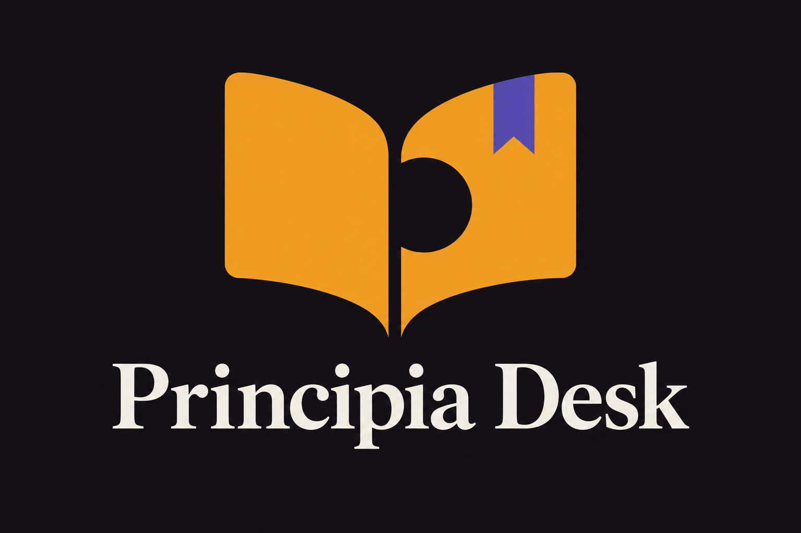
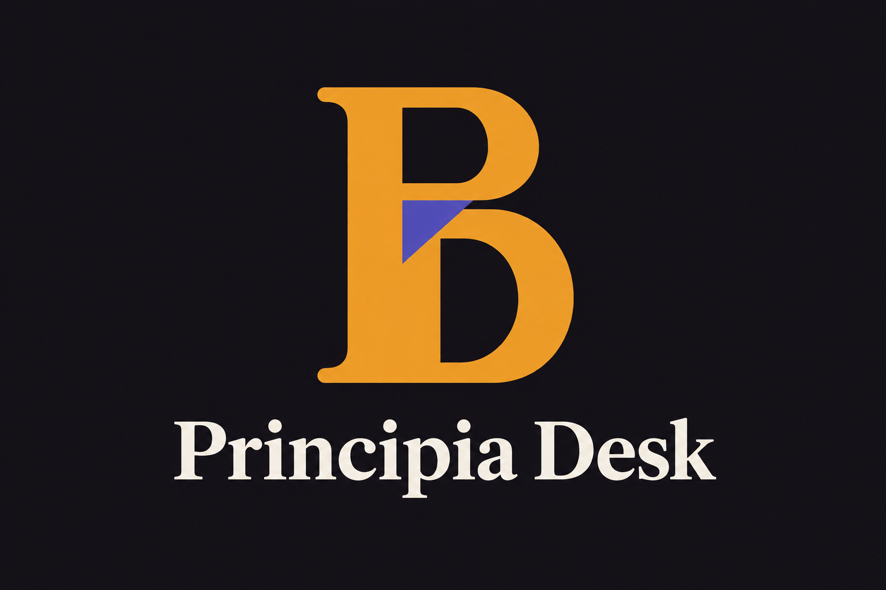
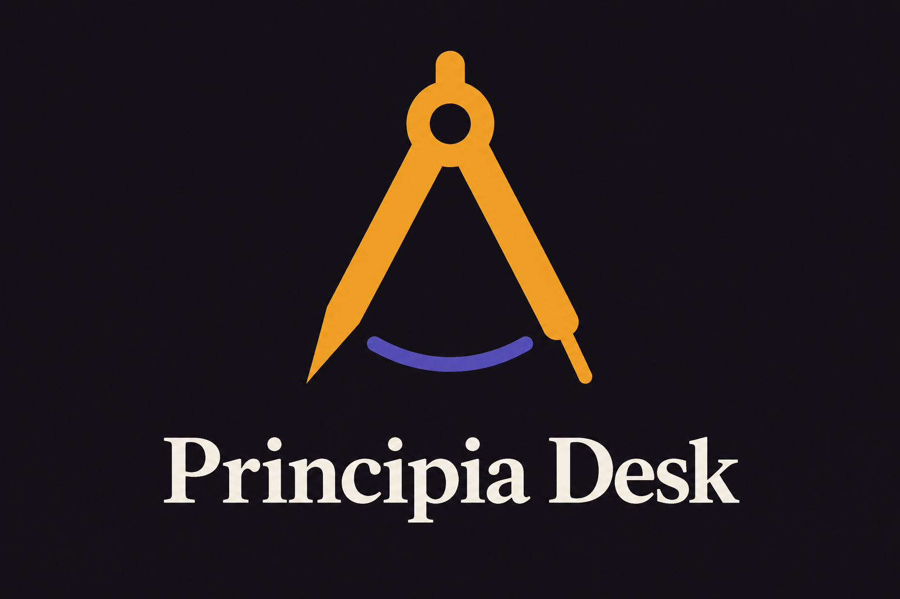
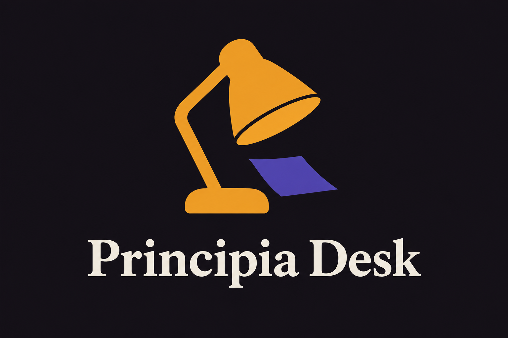
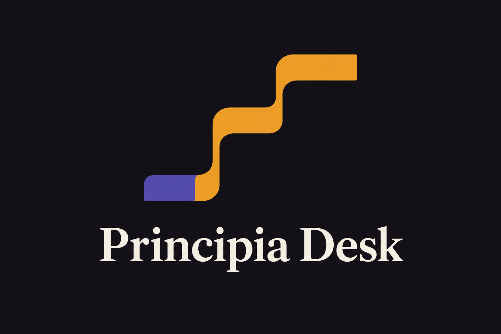

# Principia Desk — five logo directions

Status: five concepts for user selection. None has been applied to the app or installed desktop icons.

Generated with the built-in image generation tool. All five use a common amber, violet and aubergine palette with an ivory serif wordmark. These are raster concept presentations; the selected direction will need a clean vector master and small-size icon refinement. The generated surfaces include slight tonal variation despite the flat-color prompt.

## 1. Folio

An open book with a violet bookmark: warm, familiar, and immediately connected to learning.



## 2. Axiom

A compact architectural monogram: formal and distinctive. The P/D separation needs refinement if selected; the current silhouette can also read as B.



## 3. First Point

A drafting compass and construction arc: reasoning from first principles, with a direct connection to the name Principia.



## 4. Study Lamp

A desk lamp illuminating a page: a personal, focused place to learn across many subjects.



## 5. Ascent

A continuous rising path with a foundation: steady progress and knowledge built in stages.



## Generation record

Each concept was generated independently with one full prompt and no reference image. Originals remain in the generation directory; the PNGs above are unchanged copies.

### 1. Folio — exact prompt

```text
Use case: logo-brand. Asset: a polished logo direction for Principia Desk, a native desktop application for learning engineering, languages and practical skills from first principles.
Create ONE professional logo presentation on a completely OPAQUE UNIFORM deep aubergine #141118 rectangular background. Do not extract the background. No transparent pixels. A large distinctive symbol centered above the exact wordmark "Principia Desk", with generous breathing room. Landscape 3:2 composition. Symbol should occupy approximately the upper half, wordmark comfortably below. Use warm amber #EF9F27 for the main symbol, restrained muted violet #534AB7 only where specified, warm ivory #F2EDE4 for lettering.
Wordmark: refined editorial serif similar in spirit to Fraunces, medium weight, impeccably spaced, exact spelling "Principia Desk". No other text or tagline.
Flat vector-like precision, solid colors, smooth edges, subtly rounded corners. Bold simple shapes, identifiable at desktop app-icon size. Clean modern scholarly feeling. No gradients, metallic rendering, shadows, textures, distressed edges, glow, 3D, mockup scene, dice, roulette imagery, graduation caps, robot heads, brains or generic AI sparkles. No decorative diagrams or background grid.
Direction: FOLIO. A beautifully economical open-book symbol made from two folded amber page shapes. The central negative space quietly suggests the lowercase letter p, without drawing a separate letter. One short violet bookmark provides the only secondary accent. Broad clean surfaces, graceful symmetry with a small purposeful asymmetry from the bookmark. A warm, immediately understandable learning identity. No dots floating above the book, no human figure, no magnifying glass.
```

### 2. Axiom — exact prompt

```text
Use case: logo-brand. Asset: a polished logo direction for Principia Desk, a native desktop application for learning engineering, languages and practical skills from first principles.
Create ONE professional logo presentation on a completely OPAQUE UNIFORM deep aubergine #141118 rectangular background. Do not extract the background. No transparent pixels. A large distinctive symbol centered above the exact wordmark "Principia Desk", with generous breathing room. Landscape 3:2 composition. Symbol should occupy approximately the upper half, wordmark comfortably below. Use warm amber #EF9F27 for the main symbol, restrained muted violet #534AB7 only where specified, warm ivory #F2EDE4 for lettering.
Wordmark: refined editorial serif similar in spirit to Fraunces, medium weight, impeccably spaced, exact spelling "Principia Desk". No other text or tagline.
Flat vector-like precision, solid colors, smooth edges, subtly rounded corners. Bold simple shapes, identifiable at desktop app-icon size. Clean modern scholarly feeling. No gradients, metallic rendering, shadows, textures, distressed edges, glow, 3D, mockup scene, dice, roulette imagery, graduation caps, robot heads, brains or generic AI sparkles. No decorative diagrams or background grid.
Direction: AXIOM. A memorable interlocking PD monogram built as one compact architectural glyph. The P and D share a single vertical spine; a deliberate open counter makes both initials readable without clutter. Use amber for the substantial monogram, with one small violet inset plane at the shared join. A few confident straight strokes and generous rounded counters, balanced like a well-designed letterpress seal. Sophisticated and timeless. Do not add books, circles around the monogram or any pictorial objects.
```

### 3. First Point — exact prompt

```text
Use case: logo-brand. Asset: a polished logo direction for Principia Desk, a native desktop application for learning engineering, languages and practical skills from first principles.
Create ONE professional logo presentation on a completely OPAQUE UNIFORM deep aubergine #141118 rectangular background. Do not extract the background. No transparent pixels. A large distinctive symbol centered above the exact wordmark "Principia Desk", with generous breathing room. Landscape 3:2 composition. Symbol should occupy approximately the upper half, wordmark comfortably below. Use warm amber #EF9F27 for the main symbol, restrained muted violet #534AB7 only where specified, warm ivory #F2EDE4 for lettering.
Wordmark: refined editorial serif similar in spirit to Fraunces, medium weight, impeccably spaced, exact spelling "Principia Desk". No other text or tagline.
Flat vector-like precision, solid colors, smooth edges, subtly rounded corners. Bold simple shapes, identifiable at desktop app-icon size. Clean modern scholarly feeling. No gradients, metallic rendering, shadows, textures, distressed edges, glow, 3D, mockup scene, dice, roulette imagery, graduation caps, robot heads, brains or generic AI sparkles. No decorative diagrams or background grid.

Direction: FIRST POINT. A spare, confident drafting-compass symbol represents reasoning from first principles. Two substantial amber legs form an elegant narrow inverted V, joined by one simple circular pivot near the top. A single short violet arc below them hints at constructing an idea precisely. Distinct asymmetric tips make this unmistakably a drawing compass rather than the letter A. Rounded joins, clean open negative space and no tiny mechanical details. A modern scholarly instrument, not an ornate compass rose. No surrounding circle, book, lamp, orbit, globe or decorative mathematical annotations.
```

### 4. Study Lamp — exact prompt

```text
Use case: logo-brand. Asset: a polished logo direction for Principia Desk, a native desktop application for learning engineering, languages and practical skills from first principles.
Create ONE professional logo presentation on a completely OPAQUE UNIFORM deep aubergine #141118 rectangular background. Do not extract the background. No transparent pixels. A large distinctive symbol centered above the exact wordmark "Principia Desk", with generous breathing room. Landscape 3:2 composition. Symbol should occupy approximately the upper half, wordmark comfortably below. Use warm amber #EF9F27 for the main symbol, restrained muted violet #534AB7 only where specified, warm ivory #F2EDE4 for lettering.
Wordmark: refined editorial serif similar in spirit to Fraunces, medium weight, impeccably spaced, exact spelling "Principia Desk". No other text or tagline.
Flat vector-like precision, solid colors, smooth edges, subtly rounded corners. Bold simple shapes, identifiable at desktop app-icon size. Clean modern scholarly feeling. No gradients, metallic rendering, shadows, textures, distressed edges, glow, 3D, mockup scene, dice, roulette imagery, graduation caps, robot heads, brains or generic AI sparkles. No decorative diagrams or background grid.

Direction: STUDY LAMP. A beautiful compact desk-lamp silhouette in warm amber, its gently angled shade, single bent arm and solid short base forming a cohesive memorable symbol. One tiny violet page-shaped plane beneath the shade suggests a page being illuminated; no rays or glow. The character comes from the bold angled shade and purposeful negative space, not fine mechanical details. Calm and warm, an invitation to a focused personal place of learning. The lamp should be recognizable as a desktop app icon. No book, initials, circle frame, bulb filament, decorative stars or room illustration.
```

### 5. Ascent — exact prompt

```text
Use case: logo-brand. Asset: a polished logo direction for Principia Desk, a native desktop application for learning engineering, languages and practical skills from first principles.
Create ONE professional logo presentation on a completely OPAQUE UNIFORM deep aubergine #141118 rectangular background. Do not extract the background. No transparent pixels. A large distinctive symbol centered above the exact wordmark "Principia Desk", with generous breathing room. Landscape 3:2 composition. Symbol should occupy approximately the upper half, wordmark comfortably below. Use warm amber #EF9F27 for the main symbol, restrained muted violet #534AB7 only where specified, warm ivory #F2EDE4 for lettering.
Wordmark: refined editorial serif similar in spirit to Fraunces, medium weight, impeccably spaced, exact spelling "Principia Desk". No other text or tagline.
Flat vector-like precision, solid colors, smooth edges, subtly rounded corners. Bold simple shapes, identifiable at desktop app-icon size. Clean modern scholarly feeling. No gradients, metallic rendering, shadows, textures, distressed edges, glow, 3D, mockup scene, dice, roulette imagery, graduation caps, robot heads, brains or generic AI sparkles. No decorative diagrams or background grid.

Direction: ASCENT. An abstract folded ribbon forms three broad ascending steps inside a compact square footprint, suggesting knowledge built from a solid foundation. Draw it as a single continuous substantial amber band with generous dark negative space between steps and a subtly softened outer silhouette. One short violet horizontal foundation segment anchors its lower left beginning. Precise, balanced, quiet momentum, like a tiny piece of modern architecture. The final upper step ends flat; absolutely no arrowhead. A memorable simple symbol rather than a chart or an illustration. No letters, book, lamp, compass, graduation cap, maze, mountains, circles, or decorative dots. Avoid perspective and all dimensional shading; use perfectly flat two-dimensional colored shapes.
```


