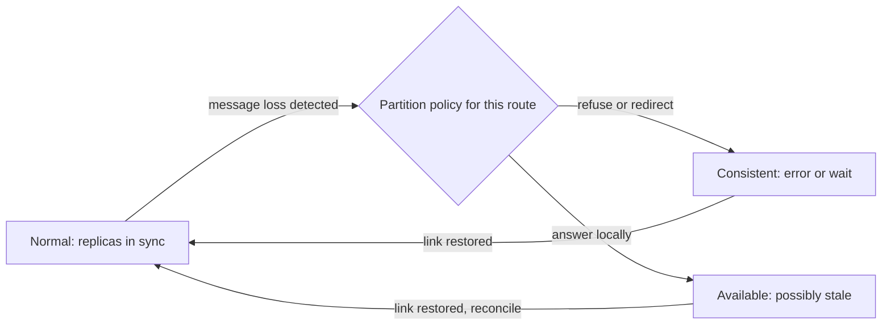
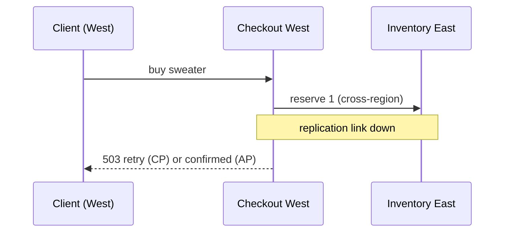

# CAP in practice: choosing partition behaviour, not a permanent label

## Why this matters

*~1 min · Read once. It says why this lesson exists and what you will be able to do.*

**Every distributed system answers one question, decided in advance or decided for it at 3 a.m.: when two parts cannot talk, what happens to the requests on each side?**

- The inventory service, the checkout flow and the capstone all replicate state across machines, so all of them face a partition sooner or later.
- The common reading of CAP, "pick two of three, forever", produces bad architecture: it labels a whole system when the theorem only constrains one moment.
- By the end you can trace, request by request, what a linearizable system and an available-first system each do under partition, put a number on the cost of each, and defend a partition timeline for one route.

> **Key idea:** CAP is a rule about behaviour *during a partition*. Outside one, you can usually have both consistency and availability.

## The simple version

*~2 min · Skim if you can already say what C, A and P each mean; read the analogy's limit either way.*

**Two warehouses, one store, one phone line.**

- Each warehouse keeps its own ledger of stock. Every sale is phoned to the other before it is confirmed, so both ledgers agree.
- Cut the phone line. A customer walks into the West Coast warehouse asking for the last blue sweater.
- The manager has exactly two choices for as long as the line is down: refuse to sell until it is fixed (keep the ledger true, lose the sale) or sell and reconcile later (keep serving, risk selling the same sweater twice).
- That is the whole theorem. Consistency: every ledger agrees, in one order of events. Availability: every customer gets an answer, not "come back later". Partition tolerance: the line can go dead and the warehouses keep operating as separate places.

> **Example:** Google's SRE book states the trigger plainly: if two nodes cannot communicate, the system can either stop serving some requests or serve them with inconsistent views. Note the *if*.

Where the analogy breaks: a manager can improvise (hold the sweater ten minutes, call a supervisor). Software cannot; its partition behaviour is whatever the replication and consensus code was written to do. And real partitions are rarely as clean as a dead line: they are partial, one-directional and undetectable until a write times out.

## Core mechanics

*~3 min · Read closely. The exercise and three of the five check questions are built on these four building blocks.*

**Derive the theorem from four pieces, none of which assumes you know what "consistent" means.**

1. **Nodes and messages.** A distributed system is processes that hold state and learn about each other only by sending messages with unbounded delay. No shared memory, no telepathy.
2. **A partition** is any period in which some messages between nodes do not arrive within the time the system cares about. It is defined by what is observed (messages missing), not by the cause (a cut cable, congestion, a misconfigured firewall all look the same to the software).
3. **Consistency here means linearizability**, not the C in ACID: every read and write behaves as if it took effect at one instant between its call and its return, and every node agrees on that single order. etcd's API guarantees give the working definition: a read that starts after a write completed must see a value at least as recent as that write.
4. **Availability is per request**: every request to a non-failed node gets a non-error response. Not "eventually", not "after the partition".

Now put them together on the West Coast node during a partition:

- A client writes `sweater = 0` to the East node. The message to the West node does not arrive.
- A client reads `sweater` from the West node. To be linearizable, the West node must return `0`. It cannot know that value exists, because the only way to learn it is a message that never came.
- So the West node either answers from its own stale state (available, not consistent) or refuses until it can confirm (consistent, not available).

> **Key idea:** The impossibility is not a design flaw. It follows from "the only channel is a message" plus "the message did not arrive". No amount of engineering removes it; engineering only chooses the side.

> **Watch out:** Availability failures during a partition are often silent. The West node happily returns `1`; nobody sees the error because there is none. Detecting the wrong answer needs a check the system cannot do alone (a reconciliation job, an invariant audit).

## Mental model

*~1 min · The picture to carry. Check it against the trace in Core mechanics before moving on.*

**A system is a set of routes, each with a partition policy; the policy only fires when the partition detector says so.**



The policy is a per-route switch that only matters on the partition edge; both branches return to normal when the link heals.

- **Verify the model:** find where the partition detector lives (a heartbeat timeout, a quorum check) and what it feeds. If you cannot point at it, the system's partition behaviour is whatever the timeouts happen to produce.
- **Where the model breaks:** the detector itself has latency. Between the partition starting and the detector noticing, the system runs the *wrong* branch, and reads made in that gap have no guarantee at all.

## Runnable experiment

*~1 min · Do it if you have etcd installed; otherwise read the expected output and move on.*

**See a consistent store refuse rather than lie.**

> **Try it:** Start a three-member etcd cluster, then isolate one member and read through it.

```bash
# three members on one machine (goreman or three terminals)
etcdctl --endpoints=localhost:2379 put sweater 1
# isolate member 3 with a firewall rule or by stopping its peers, then:
etcdctl --endpoints=localhost:32379 get sweater            # linearizable by default
etcdctl --endpoints=localhost:32379 get sweater --consistency=s   # serializable: local read
```

- Expected: the default read blocks and then fails with a context deadline, because a linearizable read must confirm leadership with a quorum it cannot reach.
- Expected: the `--consistency=s` read returns at once with whatever the isolated member last saw. That is the AP branch, chosen per request by a flag.
- The observation to record: the same store offers both branches; the choice is made by the caller, per read.

## Production architecture lens

*~2 min · Read closely: this is the scenario the exercise extends, traced through one request.*

**Two regions, a checkout service, and the replication link between them fails mid-transaction.**

- Workload: 2,000 checkouts a minute, two regions, one inventory table replicated asynchronously East to West.
- Invariant: never confirm a sale the warehouse cannot fulfil.
- Ownership: the checkout team owns the write path; the inventory team owns the replication and the reconciliation job.



One checkout crosses the failed link; the response the client gets is the partition policy made visible.

- The CP branch costs sales: at 2,000 a minute, a ten-minute partition refuses about 20,000 checkouts. The number is knowable in advance.
- The AP branch costs correctness: some confirmations exceed stock. The count is unknown until reconciliation runs, and each one becomes a cancellation email.
- What exposes the failure: refusal rate per route for CP; oversell count from the reconciliation job for AP.

> **Decision:** Choose CP for the reservation write, because the invariant is money and the cost is countable. Choose AP for the product-page stock badge, because a stale "in stock" is cheap and a blank page is not. The signal to revisit is the partition rate itself: above a few a week, the CP refusals dominate and the write path needs a regional ownership split instead.

## Trade-offs and failure modes

*~1 min · A decision table. Skim the rows you already agree with.*

| Route | Guarantee required | Mechanism | Signal to revisit |
| --- | --- | --- | --- |
| `POST /checkout` | Linearizable reservation | Quorum write, refuse on partition | Refusal rate above 0.1% of requests |
| `GET /product/:id` stock badge | Bounded staleness (60 s) | Local read, replicated asynchronously | Oversell complaints trace to badge |
| `GET /orders/me` | Read-your-writes | Route to the region that took the write | Cross-region users above 5% |

- **Silent divergence:** the AP branch produces no error, so it needs a reconciliation job with its own alert.
- **Detector lag:** a partition shorter than the heartbeat timeout is never noticed, and every read in it is unguaranteed. Shorter timeouts trade this for false partitions under load.
- **Reversibility:** switching a route from AP to CP is safe at any time; the reverse is not, because AP writes made during a partition may already conflict.

## Migration and observability

*~1 min · Skim; the point is that the policy is a runtime setting, not a rewrite.*

**Move one route at a time, and watch the two numbers that tell the branches apart.**

- Migrate by adding the partition policy as configuration per route, defaulting to today's behaviour, then flipping one route with the reconciliation job already running.
- Roll back by flipping the setting; no data migration is involved, which is why the policy belongs in configuration and not in code paths.
- Observe: partition detector firings per hour, refusal rate per CP route, oversell count per AP route, and reconciliation lag. A dashboard with those four tells you which branch is costing what.

> **Watch out:** A route with no policy is not "consistent by default". It behaves however its timeouts fall, which is the worst of both branches.

## Practical exercise

*~1 min · What you will build in the practice slot; the steps are in the workspace below.*

**A partition timeline for one more route of the checkout scenario, with its policy defended.**

- Pick either the email field of the profile or the avatar URL, and trace one partition through it as the diagram above traces the sweater.
- Decide the branch, name the mechanism, and state the number that would make you change your mind.
- Fits the ten-minute practice slot: one route, one timeline, one paragraph. It becomes a row in the capstone's consistency policy table.

## Key takeaways

*~1 min · The five lines to remember.*

- CAP constrains behaviour during a partition; outside one, consistency and availability usually coexist.
- Consistency here is linearizability: one global order, reads see completed writes. Availability is per request.
- The impossibility follows from "messages are the only channel" plus "the message did not arrive".
- Decide per route, in configuration: CP where the invariant is money, AP where staleness is cheap.
- A route with no stated policy runs whichever branch its timeouts produce, silently.
